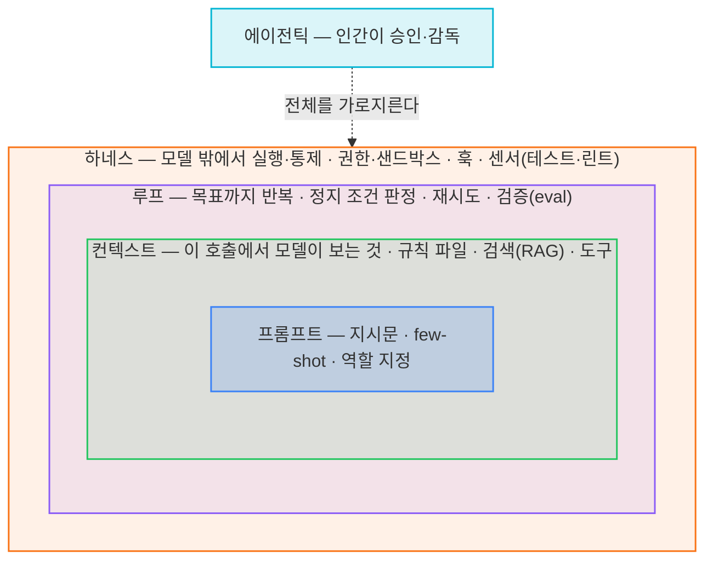

# 에이전트 워크플로우와 개발자의 중심 잡기

> **한 줄 요약**
> 일곱 개의 이름이 생겼고, 그중 넷은 **최근 여섯 달 사이**에 나왔다. 각각은 서로 다른 문제를 다루지만, **앞의 것을 대체하지 않고 위에 쌓인다.** 그래서 신경 쓸 것의 총량은 계속 늘어난다. 결국 실전에서 손댈 곳은 몇 갈래 안 된다. 이름을 세는 대신 지금 내 문제가 어느 층에서 나는지 보면 되고, 필요한 것은 그때 취하고 낡은 것은 버리면 된다.

---

## 1. 이 글의 목적

에이전트와 함께 일하는 워크플로우를 두고 일곱 가지 이름이 붙었다. 프롬프트 엔지니어링, vibe coding, 컨텍스트 엔지니어링, 에이전틱 엔지니어링, 하네스 엔지니어링, 루프 엔지니어링, 그리고 그래프 엔지니어링.

그리고 **뒤의 네 개는 2026년 2월부터 7월 사이에 나왔다**(2월에만 둘). 새 이름이 붙을 때마다 블로그가 쏟아지고, 베스트 프랙티스가 갱신되고, 몇 달 뒤 그 베스트 프랙티스가 낡는다. 낡았다는 공지는 오지 않는다. 그래서 우리 설정 파일에는 **2024년에 필요했던 규칙과 2026년에 필요한 규칙이 같은 무게로 섞여 있다.**

이 글은 세 가지를 순서대로 한다.

1. **이렇게 빠르게 발전해왔다** — 각 용어가 언제, 어떤 문제에서 나왔고 서로 어떤 관계인지 ([2절](#2-이렇게-빠르게-발전해왔다)~[3절](#3-대체인가-누적인가))
2. **결국 무엇을 더하고 뺄까** — 이름 대신 지금 손댈 층을 가려낸다 ([4절](#4-결국-무엇을-더하고-뺄까))
3. **새것과 오래 공존한다** — 필요한 것은 가볍게 취하고, 낡은 것은 편하게 버린다 ([5절](#5-새것은-가볍게-받아들이고-낡은-것은-편하게-버린다))

그리고 이 판단을 **Claude Code·Codex 설정 파일 수준으로 내리는 실전**은 별도 글 [에이전트 워크플로우, 이론은 알겠고 실전에서는 어떻게 쓸까?](/posts/22-에이전트-워크플로우-실전에서는-어떻게-쓸까)(실전편)에서 다룬다.

### 먼저, 30초 자가진단 — 나는 얼마나 잘 따라가고 있을까?

각 항목은 특정 세대의 습관이다. 체크된 것 중 **가장 이른 세대**가 당신이 실제로 서 있는 자리다.

| 체크 | 습관 | 어느 세대인가 |
|---|---|---|
| ☐ | 프롬프트마다 few-shot 예제를 3~5개 넣는다 | **1세대**(프롬프트) — 지금은 대개 불필요 ([4.1절](#41-모델이-이미-잘하는-일은-덜어낸다)) |
| ☐ | "단계적으로 생각해봐"를 여전히 붙인다 | **1세대** — 추론 모델에는 역효과일 수 있다 ([4.1절](#41-모델이-이미-잘하는-일은-덜어낸다)) |
| ☐ | 규칙 파일에서 마지막으로 **줄을 지운** 게 언제인지 모른다 | **2세대**(컨텍스트)에서 멈춤 — 더하기만 하고 있다 |
| ☐ | 규칙을 파일로 쪼개면 컨텍스트가 절약된다고 믿는다 | **2세대의 흔한 오해** ⚠️ |
| ☐ | 작업을 마이크로 태스크로 잘게 쪼개 지시한다 | **3세대**(에이전틱) 초기 습관 ([4.1절](#41-모델이-이미-잘하는-일은-덜어낸다)) |
| ☐ | 같은 실수가 반복되는데 규칙만 추가한다 | **4세대**(하네스) 미도달 — 게이트가 없다 |
| ☐ | "무엇이 완료인가"를 실행 가능한 검사로 준 적이 없다 | **5세대**(루프) 미도달 |
| ☐ | 설정을 바꾼 뒤 성능이 올랐는지 측정한 적이 없다 | 전 세대 공통 |

**판정** — 위쪽에 체크가 몰렸다면 최신 도구를 쓰면서도 낡은 습관을 그대로 안고 있다는 뜻이다. 뒤처졌다는 신호가 아니라, 걷어낼 짐이 쌓였다는 신호다. 새 개념을 서둘러 배우기보다, 이미 필요 없어진 것부터 하나씩 덜어내면 된다. 아래쪽 두 항목만 체크됐다면 대부분 잘 하고 있고, 완료를 판단하는 기준 하나만 갖추면 된다.

4번 항목은 공식 문서가 명시적으로 부정하는 오해다.

---

## 2. 이렇게 빠르게 발전해왔다

### 2.1 연표

| 시기 | 용어 | 계기 / 출처 | 답하려는 질문 | 전제한 모델의 약점 |
|---|---|---|---|---|
| 2020~2022 | **프롬프트 엔지니어링** | Gwern Branwen이 GPT-3 맥락에서 용어 사용(2020)[^prompt] · ChatGPT로 대중화(2022) | "이 문장을 어떻게 쓸까?" | 모델이 **내 의도를 못 알아듣는다** |
| **2025.02** | *(vibe coding)* | Karpathy의 트윗(2월 2일)[^vibe] | "일단 던져보고 붙여넣기" | — (규율의 부재에 이름을 붙인 것) |
| **2025.06** | **컨텍스트 엔지니어링** | Shopify CEO Tobi Lütke가 제안(6월 19일)하고 Karpathy가 "+1"로 확산(6월 25일)[^karpathy] → 2025년 9월 Anthropic이 공식 문서화[^anthropic-ce] | "이번 호출에서 모델이 **무엇을 보는가**?" | 모델이 **내 코드베이스·배경을 모른다** |
| **2026.02** | **하네스 엔지니어링** | Mitchell Hashimoto의 "My AI Adoption Journey"(2월 5일, 5단계 "Engineer the Harness")가 계기 · OpenAI 현장 보고(2월 11일)로 확산[^harness] · 4월 Böckeler가 martinfowler.com에 체계적으로 정리[^fowler] | "시스템이 무엇을 **예방·측정·교정**해야 하는가?" | 모델이 **같은 실수를 반복한다** |
| **2026.02** | **에이전틱 엔지니어링** | Karpathy가 vibe coding 시대의 종료를 선언[^agentic] · ICSE 2026에 전용 워크숍(AGENT 2026) 개설 | "에이전트를 **어떻게 감독·오케스트레이션**하는가?" | 모델이 **감독 없이 두면 엉뚱한 걸 만든다** |
| **2026.06** | **루프 엔지니어링** | Peter Steinberger(OpenClaw)의 "수동으로 프롬프트하지 않는다" 포스트(6월 7일)가 계기 · 이후 확산[^loop] | "목표 달성까지 **반복되는 자율 워크플로**는? **무엇이 완료인가?**" | 모델이 **언제 멈춰야 할지 모른다** |
| **2026.07 ~ 현재** | **그래프 엔지니어링** | 같은 Steinberger의 "아직 루프 얘기 중인가, 아니면 그래프로 넘어갔나?" 포스트(7월 18일)가 촉발[^graph] | "여러 에이전트를 **어떤 구조로 연결**하는가?" | **에이전트 하나로는 안 되는** 일을 나눠 맡길 때, 그 조직을 짜야 한다 |

**표에서 눈에 걸리는 건 아래 네 줄의 간격이다.** 2026년 **2월 → 6월 → 7월**, 그중 2월에만 두 개가 붙었다. 앞의 두 세대는 각각 몇 년을 버텼는데, 최근 네 개는 여섯 달 안에 쏟아졌다. 체감하는 피로의 정체가 여기에 있다. 아래 [5절](#5-새것은-가볍게-받아들이고-낡은-것은-편하게-버린다)이 필요한 이유가 이것이다.

각 이름이 다루는 대상은 서로 다르다. [2.3절](#23-각-용어가-실제로-무엇을-가리키는가)에서 보듯 프롬프트는 문장을, 컨텍스트는 호출 하나의 입력 전체를, 하네스는 모델 밖 런타임을, 루프는 시간축을, 그래프는 여러 에이전트 사이의 연결을 다룬다. 뒤의 것이 앞의 것을 포함하기도 하지만, 앞에 없던 문제를 새로 여는 쪽이 더 크다.

그래서 피로의 원인은 **새 층이 앞의 것을 대체하지 않는다**는 데 있다. 계속 쌓인다. 게다가 무엇이 더 이상 필요 없어졌는지는 아무도 알려주지 않는다. 새 이름이 나올 때마다 "이제 이걸 하세요"는 쏟아지지만, "그럼 저건 이제 안 해도 됩니다"는 듣기 어렵다. 그 결과 규칙 파일은 한 방향으로만 자란다. 지금도 필요한지 다시 볼 것들은 [4.1절](#41-모델이-이미-잘하는-일은-덜어낸다)에서 정리한다.

### 2.2 개념이 왜 이렇게 빨리 늘어날까?

그렇다면 왜 이토록 빠르게 늘었을까. 마케팅 때문이 아니다. **모델이 한 계단 오를 때마다 이전에는 문제가 아니던 것이 문제가 됐고, 그 새 문제를 다루는 기술에 이름이 붙었다.** 능력이 올라가면 그 능력으로 할 수 있는 일의 범위가 넓어지고, 넓어진 범위에서 새 실패가 나타난다.

| 모델 쪽에서 풀린 것 | 그러자 새로 중요해진 문제 | 붙은 이름 |
|---|---|---|
| 지시를 알아듣게 됐다 | 내 코드베이스를 모른다 | 컨텍스트 엔지니어링 |
| 컨텍스트 윈도가 20만 토큰이 됐다 | 넣을 게 많아지자 **무엇을 뺄지**가 문제가 됐다 | 컨텍스트 엔지니어링(후기) |
| 도구 호출이 안정화됐다 | 여러 단계를 혼자 돌리다 엉뚱한 데로 간다 | 에이전틱 / 하네스 |
| 장기 작업을 버티게 됐다 | 같은 실수를 반복한다 | 하네스 엔지니어링 |
| 사람 없이도 여러 턴을 돈다 | **언제 멈출지**, 무엇이 <strong>"좋음"</strong>인지 모른다 | 루프 엔지니어링 |
| 행동의 위험을 모델이 판단하게 됐다 (auto mode 분류기) | 승인 지점을 **어디에** 남길지 | 루프의 outer loop 설계 |
| 에이전트 하나가 제법 긴 일을 해낸다 | 하나로 안 되는 일을 **여러 에이전트에 어떻게 나눌지** | 그래프 엔지니어링 |

**모델이 강해질수록 설계의 초점은 "모델이 못하는 것"에서 "인간이 정해주지 않은 것"으로 이동한다.** 초기 세대가 모델의 결함을 보완하는 기술이었다면, 최근 세대는 **의도를 명시하는 기술**에 가깝다. 이 흐름이 [4절](#4-결국-무엇을-더하고-뺄까)의 결론으로 이어진다.

### 2.3 각 용어가 실제로 무엇을 가리키는가

연표에서 본 문제의 변화를 각 용어의 정의로 다시 펼쳐보자. 이름만 갈아 끼운 게 아니라는 건, 각자가 다루는 **단위**가 서로 다르다는 데서 드러난다.

**프롬프트 엔지니어링** — 개별 메시지의 문구를 최적화한다. chain-of-thought, few-shot 예제, 역할 지정. 단위는 **문장**이다.

**컨텍스트 엔지니어링** — 호출 하나에서 모델이 조건화되는 전체 패키지를 설계한다. 대화 이력, RAG 청크, 도구 정의, 규칙 파일, MCP 결과. 단위는 **호출 하나의 입력 전체**다. 프롬프트를 포함하지만, 도구 정의나 검색 결과처럼 앞 세대에 없던 것들이 함께 들어온다.

> "context engineering is the delicate art and science of filling the context window with just the right information for the next step." — Karpathy[^karpathy]
>
> "find the smallest possible set of high-signal tokens that maximize the likelihood of some desired outcome" — Anthropic[^anthropic-ce]

두 번째 인용의 **smallest**가 이 분야의 목적함수다. 더하기가 아니라 빼기다.

**에이전틱 엔지니어링** — 인간의 역할을 재정의한다.

> "'Agentic' because the new default is that you are not writing the code directly 99% of the time. You are orchestrating agents who do and acting as oversight." — Karpathy[^agentic]

단위는 **작업 흐름과 감독 지점**이다.

**하네스 엔지니어링** — Böckeler의 정의는 간결하다. **"Agent = Model + Harness"**, 하네스는 "코딩 에이전트에서 모델을 뺀 전부"다.[^fowler] 단위는 **모델 밖의 런타임**이다 — 도구, 권한, 샌드박스, 검증 장치. 컨텍스트가 "무엇을 보여줄까"라면 여기는 "무엇을 할 수 있게 할까"다. 그리고 이 글에서 가장 실용적인 좌표계가 여기서 나온다.

|  | **계산적** (결정론적·빠름) | **추론적** (의미적·느림) |
|---|---|---|
| **가이드** (사전 예방) | 린터 설정, 타입 시스템, `permissions.deny` | 규칙 파일, 프롬프트 지시, **auto mode 분류기** |
| **센서** (사후 교정) | 테스트, 타입체커, 빌드 실패 | AI 코드리뷰, LLM-as-judge |

Böckeler는 이렇게 말한다.

> "A good harness should not necessarily aim to fully eliminate human input, but to direct it to where our input is most important."[^fowler]

**루프 엔지니어링** — 반복 구조와 **정지 조건**을 설계한다. "내가 매번 프롬프트하는 대신, 프롬프트를 대신 해주는 시스템을 만든다." 단위는 **시간축**이다 — 한 번의 호출이 아니라 목표에 닿을 때까지의 반복 전체. 앞의 어느 층에도 없던 대상이다. 실무는 두 겹으로 나눈다.[^aiewf]

- **inner loop** — 에이전트가 자동으로 도는 부분
- **outer loop** — 인간의 감시, 피드백 신호, eval이 들어가는 부분

**그래프 엔지니어링** — 여러 에이전트를 노드로, 그 사이의 의존성과 데이터 흐름을 엣지로 놓고 **조직 자체를 설계한다.** 정리하자면 *"루프는 에이전트의 행동을 프로그래밍 가능하게 만들었고, 그래프는 에이전트의 조직을 프로그래밍 가능하게 만든다."*[^graph] 단위는 **에이전트들 사이의 관계**다. 역할이 고정된 org graph(누가 존재하는가)와 작업마다 생겼다 사라지는 work graph(지금 무엇을 해야 하는가)를 나눠 본다.

다만 그래프는 앞선 세대들보다 **"이름만 새롭다"는 반발이 유독 컸다.~~(솔직히 나도 이게 무슨 짓인가 싶다)~~** 그래프·상태머신 오케스트레이션은 LangGraph·AutoGen 같은 도구가 이미 하던 것이고, 등장 당일부터 "그냥 루프 아니냐"는 조롱이 붙었다.[^graph] 이 반발은 절반은 맞다. 정확히 정리하면 이렇다 — **루프는 그래프의 한 노드다.** 루프에서 그래프로 "졸업"하는 게 아니라, **루프 하나로 부족할 때 여러 루프를 그래프로 합성**하는 것이다. 정말 새로운 것은 개념이 아니라 여러 노드를 병렬로 두고 fan-out/fan-in하는 부분, 그리고 그걸 부르는 이름이다. 그래서 앞의 다른 세대들이 "이름만 바뀐 게 아니라 실제로 다른 문제를 연다"고 말할 수 있었던 것과 달리, 그래프는 **진짜이면서 동시에 과대포장인** 애매한 자리에 있다. [5.1절](#51-새-개념이-나오면-세-가지만-본다)에서 그래프를 굳이 "지금은 이름만 알아두라"고 미뤄둔 이유가 이것이다.

논의는 여기까지 와 있다. AI Engineer World's Fair 2026(7월) 정리에서 **루프가 새로운 제어 계층**으로 꼽혔고, 그 위에 그래프가 얹히는 흐름이다. 함께 확인되는 방향은 두 가지다. ① 에이전트 중심에서 **시스템 중심**으로의 전환, ② 모든 플랫폼이 **Skills**(마크다운 선언 파일)로 수렴하며 오케스트레이션 코드 없이 능력을 확장하는 방향이다.[^aiewf]

> 재미있는 건 ②다. 업계가 도달한 방향은 하네스를 **코드로 두껍게 쌓는 것**이 아니라 **마크다운 선언으로 얇게 만드는 것**이다. 그래프 엔지니어링이 LangGraph·CrewAI 같은 무거운 런타임을 부르는 것과는 반대 방향이라, **둘 중 무엇이 살아남을지는 아직 정해지지 않았다.**

---

## 3. 대체인가 누적인가

### 3.1 앞 세대는 죽지 않고 재배치된다

새 용어가 나오면 앞의 것이 죽었다고들 한다. "프롬프트 엔지니어링은 죽었다." 실제로는 그렇지 않다.

**앞 세대는 사라지지 않고 뒤 세대 안의 한 층으로 재배치된다.** 프롬프트는 여전히 쓴다. 다만 이제 그것은 "마법의 문장"이 아니라 컨텍스트 패키지의 한 구성 요소이고, 그 패키지는 루프의 한 단계에서 조립되며, 그 루프는 하네스가 실행한다.



> **하네스가 루프를 실행하고, 루프의 각 단계가 컨텍스트를 조립하고, 컨텍스트가 프롬프트를 담는다.** 에이전틱 엔지니어링은 이 전부를 가로질러 "인간은 어디서 개입하는가"를 다룬다.

따라서 "무엇을 배워야 하나"에 대한 답은 <strong>"가장 최신 것"이 아니라 "지금 겪는 실패가 어느 층에서 나는지"</strong>다.

### 3.2 그런데 포함 방향조차 합의되지 않았다

**"하네스와 컨텍스트, 무엇이 무엇을 포함하는가"에 대해 진지한 사람들의 답이 서로 반대다.**

| 주장 | 포함 관계 | 근거 |
|---|---|---|
| mtrajan | **하네스 ⊃ 컨텍스트** | *"Context gives information. Harness creates a place where the agent doesn't need supervision."* 컨텍스트는 완벽한 온보딩 문서 — 필요하지만 충분하지 않다[^notcontext] |
| Rick Hightower | **하네스 ⊃ 컨텍스트** | 모델은 CPU, 컨텍스트는 RAM, 하네스는 **OS**[^cpuos] |
| explainX | **하네스 ⊃ 루프 ⊃ 컨텍스트 ⊃ 프롬프트** | 하네스가 루프를 구현하고, 루프가 컨텍스트를 조립한다[^explainx] |
| Böckeler | **직교** | 하네스는 "무엇을 규제할까", 컨텍스트는 "그것을 어떻게 접근 가능하게 할까". 컨텍스트는 가이드와 센서를 **전달하는 수단**[^fowler] |

네 개의 서로 다른 답이 공존한다. 각각은 분명히 다른 문제를 가리키는데도 그렇다. 이유는 이렇다.

> **문제는 다르지만 대상이 겹친다.** 규칙 파일을 무엇으로 채울지(컨텍스트)와 그것을 어떻게 강제할지(하네스)는 분명 다른 질문이지만, 같은 `CLAUDE.md` 앞에서 만난다. 층들이 서로 물려 있어서 **어디를 기준으로 자르느냐에 따라 포함 방향이 뒤집힌다.** 합의가 안 되는 건 개념이 없어서가 아니라, 경계가 배타적이지 않아서다.

그러니 "하네스가 컨텍스트를 포함하나요?"라는 질문에서 정답을 고르려 하기보다, <strong>"당신 팀의 실패가 어느 쪽에서 나는가"</strong>로 질문을 바꾸는 편이 낫다. 마침 이 논쟁의 한쪽이 실용적인 판별법을 남겼다.

> *"watch where things fail. Wrong output once? Probably context. Slow degradation over weeks? That's a harness problem."*[^notcontext]
> (한 번 틀렸다 → 컨텍스트 문제. 몇 주에 걸쳐 서서히 나빠졌다 → 하네스 문제.)

포함 관계에 동의하지 않아도 이 판별법은 쓸 수 있다. 중요한 것은 용어의 경계를 확정하는 일이 아니라, 실패가 발생한 지점을 찾는 일이기 때문이다.

---

## 4. 결국 무엇을 더하고 뺄까

지금까지의 용어를 모두 별개의 기술처럼 기억할 필요는 없다. 실전에서 어떤 설정을 더하고 뺄지 판단하려면, 먼저 무엇이 이미 필요 없어졌고 무엇이 끝까지 남는지부터 가리면 된다.

### 4.1 모델이 이미 잘하는 일은 덜어낸다

few-shot 예제, "단계적으로 생각해봐" 같은 주문, 지나치게 잘게 쪼갠 작업 지시가 언제나 틀린 것은 아니다. 다만 지금도 필요한지는 다시 확인해야 한다. 모델이 이미 안정적으로 수행하는 일을 계속 설명하면 그만큼 중요한 정보가 묻힌다. 컨텍스트 윈도우는 창고가 아니라 작업대에 가까워서, 물건을 올릴수록 일할 자리가 줄어든다.

규칙과 도구도 마찬가지다. 모든 관례를 규칙 파일에 넣거나 모든 MCP를 미리 불러오는 방식은 한때 필요했지만, 지금은 지시 누락과 컨텍스트 낭비를 늘릴 수 있다.[^ifscale][^toolsearch] **예전에 도움이 됐다는 이유만으로 계속 남겨둘 필요는 없다.**

### 4.2 사람이 정해야 하는 것은 남긴다

반대로 모델이 좋아져도 저절로 알 수 없는 것이 있다.

- 이번 작업에서 꼭 알아야 할 배경과 팀의 관례
- 무엇을 "완료"와 "좋음"으로 볼지에 대한 기준
- 무엇을 건드리면 안 되는지에 대한 권한 경계
- 결과를 누가, 어떤 기준으로 검토할지

이것들은 모델의 능력 문제가 아니라 사람이 정해야 하는 문제다. 따라서 도구가 바뀌어도 쉽게 사라지지 않는다.

### 4.3 정보와 판정으로 나눈다

남겨야 할 것은 크게 두 갈래로 나뉜다.

**① 정보 — 이번 단계에 무엇을 보여줄까**  
프롬프트, 컨텍스트, 규칙 파일, Skills가 이 축에 속한다.

**② 판정 — 무엇을 완료·성공으로 볼까**  
테스트, 하네스의 센서, 루프의 정지 조건, eval과 리뷰가 이 축에 속한다.

이 두 갈래가 실전의 대부분을 차지한다. (앞서 나온 권한 경계처럼 성능이 아니라 안전에 관한 것은 이 바깥에 따로 있고, 여러 에이전트의 조율은 아직 자리를 잡는 중이다.) 요점은 이름의 개수가 아니다. **지금 내 문제가 정보가 부족한 쪽인지, 판단 기준이 없는 쪽인지**를 가리는 일이 먼저다.

---


## 5. 새것은 가볍게 받아들이고, 낡은 것은 편하게 버린다

기술은 계속 발전하고 새로운 개념도 계속 등장한다. 그렇다고 나오는 것마다 모두 익히고 설정에 추가할 필요는 없다. 지금 내 일을 편하게 해주는 것은 가져오고, 더는 도움이 되지 않는 것은 빼면 된다.

중요한 것은 최신 상태를 증명하는 일이 아니다. **현재의 도구와 규칙이 지금의 문제를 실제로 해결하고 있는지**다.

### 5.1 새 개념이 나오면 세 가지만 본다

새로운 프레임워크나 기법을 발견하면 다음 세 가지를 확인한다.

1. **지금 내가 겪는 문제를 해결하는가?**
2. **이미 쓰고 있는 장치와 겹치지 않는가?**
3. **도입한 뒤 일이 더 단순해지는가?**

세 질문에 답이 분명하면 써보면 된다. 지금 필요하지 않다면 이름만 알아두고 지나가도 괜찮다. 나중에 문제가 생겼을 때 다시 꺼내보면 된다.

예를 들어 **그래프 엔지니어링**을 이 세 질문에 넣어보자. ① 지금 내가 겪는 문제를 해결하는가 — 에이전트 하나로 처리되는 일이 대부분이라면 아직 아니다. 그래프는 **여러 에이전트를 나눠야 할 만큼** 일이 커졌을 때의 도구다. ② 이미 쓰는 장치와 겹치는가 — 단일 에이전트 워크플로에서는 루프 하나로 충분하다. ③ 도입하면 단순해지는가 — 오히려 LangGraph 같은 런타임과 노드 간 상태 관리라는 복잡성이 더해진다. 세 답이 이렇다면 결론은 간단하다. **이름만 알아두고, 멀티 에이전트가 실제로 필요해지는 날 다시 꺼내면 된다.** 몰라서 손해 볼 일은 없고, 미리 들여놨다가 짊어질 유지비만 없앤 셈이다.

비용은 새 개념을 모르는 데서가 아니라, 필요하지 않은 개념을 계속 들고 가는 데서 생긴다.

### 5.2 추가한 것에는 이유와 유효기간을 남긴다

규칙이나 도구를 추가할 때는 **왜 추가했는지**, **언제 다시 볼지**를 함께 적어둔다.

```markdown
<!-- 2026-03 추가: 모델이 에러 포맷을 자꾸 새로 만들어서. 2026-09 재검토 -->
- 에러 응답은 `src/api/errors.ts`의 표준 포맷을 쓴다
```

이유가 남아 있으면 나중에 같은 문제가 사라졌는지 확인할 수 있다. 재검토 시점이 오면 규칙을 유지하는 데 근거가 필요한 것이지, 지우는 데 죄책감이 필요하지는 않다.

도구도 같은 방식으로 관리한다. 한동안 사용하지 않은 MCP, 더 단순한 기능으로 대체된 훅, 모델이 이제 안정적으로 처리하는 지시는 끄거나 지워본다. 문제가 다시 나타나면 그때 복구하면 된다.

### 5.3 남길 기준보다 버릴 기준을 먼저 만든다

다음 중 하나에 해당하면 제거 후보로 본다.

- 해결하려던 문제가 더는 재현되지 않는다.
- 다른 규칙이나 도구와 같은 역할을 한다.
- 최근 작업에서 사용되지 않았다.
- 제거해도 결과가 달라지지 않는다.
- 유지하려면 계속 설명과 예외가 필요하다.

반대로 안전과 권한 경계, 팀 고유의 완료 기준처럼 사람이 직접 정해야 하는 것은 남긴다. 다만 이것도 긴 설명으로 붙들기보다 권한 설정, 테스트, CI처럼 더 단순하고 확실한 장치로 옮길 수 있는지 살핀다.

좋은 설정은 새로운 개념이 빠짐없이 쌓여 있는 상태가 아니다. **지금 필요한 것만 남아 있고, 필요 없어지면 쉽게 걷어낼 수 있는 상태**다.

---

## 6. 마치며

새로운 개념은 앞으로도 계속 늘어날 것이다. 가장 최근에는 그래프 엔지니어링이 나왔고, 다음도 머지않아 등장한다.

그런데 새 개념이 나올 때마다 곧바로 따라가야 하는 것은 아니다. 갓 나온 개념은 아직 설익어 있다. 언제 쓰는 게 맞는지, 무엇과 겹치는지, 어떤 함정이 있는지는 몇 달에 걸쳐 드러난다. 그 사이 조급하게 도입한 것들이 나중에는 도로 걷어내야 할 짐이 되곤 한다. 가장 최근에 붙은 그래프 엔지니어링만 해도, 지금 대부분에게는 이름만 알아두면 충분하다. 여러 에이전트를 실제로 나눠야 하는 날이 오면 그때 꺼내면 된다.

그러니 최신을 실시간으로 좇지 못한다고 불안해하지 않아도 된다. 개념이 어느 정도 검증되고 자리를 잡은 뒤에 편하게 가져오는 편이 오히려 낫다. 늦게 받아들인다고 뒤처지는 것이 아니다. 설익은 것을 먼저 끌어안았다가 도로 버리는 쪽이 더 비싸고, 새 개념을 좇느라 지치는 것이야말로 가장 큰 낭비다. **따라가지 못해 느끼는 피로는, 사실 따라갈 필요가 없는 것을 따라가려 해서 생긴다.**

---

[^prompt]: "prompt engineering" 용어는 Gwern Branwen이 GPT-3(2020) 맥락에서 사용한 것으로 널리 알려져 있다(개념 자체는 그 이전부터 존재). 대중화는 ChatGPT 공개(2022-11) 이후. 개괄: *The Prompt Report: A Systematic Survey of Prompt Engineering Techniques*, arXiv:2406.06608

[^vibe]: Andrej Karpathy, X 게시물 (2025-02-02) — "There's a new kind of coding I call 'vibe coding'…". 본인이 "shower of thoughts throwaway tweet"이라 회고. https://x.com/karpathy/status/2019137879310836075 (1주년 회고 트윗)

[^karpathy]: Shopify CEO Tobi Lütke가 "context engineering"을 "prompt engineering"보다 선호한다고 게시(2025-06-19)한 뒤, Andrej Karpathy가 6일 후 "+1"로 확산시켰다(2025-06-25). https://x.com/karpathy/status/1937902205765607626

[^agentic]: Karpathy의 "agentic engineering" 제시(2026년 2월)와 vibe coding 시대 종료 선언. https://www.aibuilderclub.com/blog/karpathy-agentic-engineering · https://buttondown.com/verified/archive/the-end-of-vibe-coding-andrej-karpathys-shift-to/ · 학계 정착: ICSE 2026 International Workshop on Agentic Engineering (AGENT 2026) https://conf.researchr.org/home/icse-2026/agent-2026 · 개괄: IBM, *What is Agentic Engineering?* https://www.ibm.com/think/topics/agentic-engineering *(정확한 일자는 2차 출처 기준)*

[^fowler]: Birgitta Böckeler, *Harness engineering for coding agent users*, martinfowler.com (2026-04-02). "Agent = Model + Harness", 가이드/센서 × 계산적/추론적, 유지보수성·아키텍처 적합성·행동 하네스 분류. https://martinfowler.com/articles/harness-engineering.html

[^harness]: "harness engineering" 용어의 등장 — Mitchell Hashimoto의 *My AI Adoption Journey*(2026-02-05), 5단계 "Engineer the Harness"가 계기로 자주 지목된다. https://mitchellh.spicytakes.org/post/2026-02-05-my-ai-adoption-journey · OpenAI 현장 보고(2026-02-11)로 확산 · Böckeler의 martinfowler.com 정리(2026-04-02)는 최초가 아니라 체계화 단계다[^fowler] · 관련 학술 정리: *AI Harness Engineering: A Runtime Substrate for Foundation-Model Software Agents*, arXiv:2605.13357 (2026-05) https://arxiv.org/pdf/2605.13357 *(용어 창안자에 대해 Hashimoto·Viv Trivedy 등 2차 출처 간 상충이 있어, 여기서는 "2월 초 등장"까지만 확정한다)*

[^loop]: 루프 엔지니어링의 등장 — Peter Steinberger(OpenClaw)의 2026-06-07 포스트가 계기, 이후 확산. https://www.mindstudio.ai/blog/what-is-loop-engineering-ai-coding-agents · https://machinelearningmastery.com/an-introduction-to-loop-engineering/ · 회의적 시각: https://blackmatter.vc/lab/loop-engineering-an-honest-verdict-from-someone-who-actually-runs-agent-loops *(날짜는 2차 출처 기준)*

[^graph]: 그래프 엔지니어링 — Peter Steinberger의 "Are we still talking loops or did we shift to graphs yet?"(2026-07-18, 575K뷰)가 촉발. org graph(안정적 역할 조직)와 work graph(작업마다 생멸하는 실행 구조)의 구분, "Loops made agent behavior programmable; graphs make agent organizations programmable"는 explainX 정리를 따랐다. https://www.explainx.ai/blog/graph-engineering-ai-agents-multi-agent-organizations-2026 · **등장 당일부터 "루프 재포장" 논쟁**이 붙었다. 균형 잡힌 정리("real and over-marketed", "루프는 그래프의 한 노드이고 졸업이 아니라 합성"): Turing Post, *Is Graph Engineering Real?* https://www.turingpost.com/p/is-graph-engineering-real-why-everyone-is-talking-about-it · explainX, *Graphs vs. Loops* https://explainx.ai/blog/graphs-vs-loops-agentic-ai-debate-linear-andrew-ng-2026 *(막 부상한 용어로, 날짜·인용은 2차 출처 기준)*

[^aiewf]: swyx et al., *5 Trends That Defined AI Engineering at World's Fair 2026*, Latent Space (2026-07-14). 루프가 새로운 제어 계층(inner/outer loop), 에이전트 중심에서 시스템 중심으로의 전환, Skills로의 수렴. https://www.latent.space/p/aiewf26trends

[^explainx]: explainX, *Context vs prompt vs loop vs harness engineering* (2026-06-29, 07-13 갱신) — "Harness implements loops → each loop step assembles context → context contains prompts". https://explainx.ai/blog/context-prompt-loop-harness-engineering-stack-2026 *(이 글은 컨텍스트 엔지니어링 대중화를 2026년 중반으로 적고 있으나, 실제 Karpathy 게시물은 2025-06-25다)*

[^notcontext]: mtrajan, *Harness Engineering Is Not Context Engineering*. https://mtrajan.substack.com/p/harness-engineering-is-not-context

[^cpuos]: Rick Hightower, *Harness Engineering vs Context Engineering: The Model is the CPU, the Harness is the OS*. https://medium.com/@richardhightower/harness-engineering-vs-context-engineering-the-model-is-the-cpu-the-harness-is-the-os-51b28c5bddbb

[^toolsearch]: Anthropic, Advanced tool use — Tool Search Tool(77K → 8.7K 토큰, 85% 절감) / Programmatic Tool Calling / Tool Use Examples (2025-11). https://platform.claude.com/docs/en/agents-and-tools/tool-use/programmatic-tool-calling · https://www.anthropic.com/engineering/writing-tools-for-agents

[^ifscale]: Daniel Jaroslawicz et al., *How Many Instructions Can LLMs Follow at Once?* (IFScale), arXiv:2507.11538 (2025). 500개 지시에서 정확도 68%, 누락이 지배적 실패, 선행 편향. https://distylai.github.io/IFScale/

[^anthropic-ce]: Anthropic, *Effective context engineering for AI agents* (2025-09). attention budget, altitude, just-in-time. https://www.anthropic.com/engineering/effective-context-engineering-for-ai-agents
