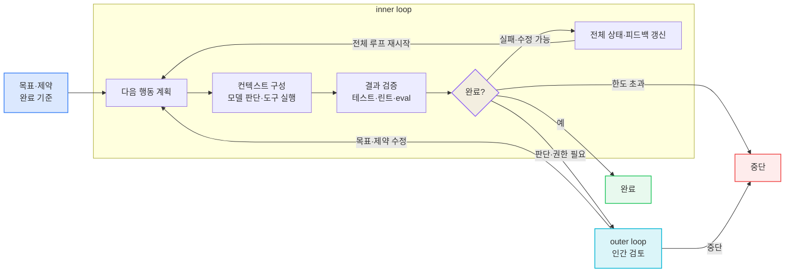
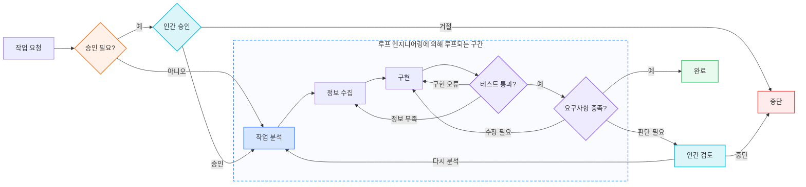

# 에이전트 워크플로우와 개발자의 중심 잡기

> **한 줄 요약**
> 이 글은 에이전트 워크플로우를 설명할 때 쓰이는 일곱 개의 이름을 지시문, 입력, 실행 환경, 반복, 제어 흐름이라는 서로 다른 설계 대상으로 구분한다. 이름을 따로 외우기보다 지금 겪는 문제가 어디서 발생하는지 보고, 필요한 장치만 선택하면 된다.

---

## 1. 이 글의 목적

에이전트와 함께 일하는 워크플로우를 두고 일곱 가지 이름이 붙었다. 프롬프트 엔지니어링, vibe coding, 컨텍스트 엔지니어링, 에이전틱 엔지니어링, 하네스 엔지니어링, 루프 엔지니어링, 그리고 그래프 엔지니어링.

이 글은 각 용어의 사용례와 정리 글을 연표에 함께 놓고 비교한다. 표의 날짜는 인용한 자료의 게시 시점이며, 각 용어의 최초 사용일이나 업계의 채택 순서를 뜻하지는 않는다. 특히 그래프형 오케스트레이션과 `graph engineering`이라는 표현은 2026년 7월 이전에도 사용됐다.[^graph]

이 글은 세 가지를 순서대로 한다.

1. **각 이름이 무엇을 가리키는가** — 인용한 자료의 시점과 각 용어가 다루는 문제, 서로의 관계를 살펴본다 ([2절](#2-용어별-등장-배경과-범위))
2. **무엇을 남기고 무엇을 덜어낼까** — 이름 대신 지금 손댈 층을 가려낸다 ([3절](#3-무엇을-남기고-무엇을-덜어낼까))
3. **새것과 오래 공존한다** — 필요한 것은 가볍게 취하고, 낡은 것은 편하게 버린다 ([4절](#4-새것은-가볍게-받아들이고-낡은-것은-편하게-버린다))

그리고 이 판단을 **Claude Code·Codex 설정 파일 수준으로 내리는 실전**은 별도 글 [에이전트 워크플로우, 이론은 알겠고 실전에서는 어떻게 쓸까?](/posts/22-에이전트-워크플로우-실전에서는-어떻게-쓸까)(실전편)에서 다룬다.

### 먼저, 30초 자가진단 — 나는 얼마나 잘 따라가고 있을까?

아래는 현재도 필요한지 다시 확인해볼 에이전트 활용 습관들이다. 해당하는 항목이 있다면 오른쪽의 관련 영역과 확인 방법을 살펴볼 수 있다.

| 체크 | 습관 | 관련 영역·확인 방법 |
|---|---|---|
| ☐ | 추론 모델에도 처음부터 few-shot 예제를 3~5개 넣는다 | **프롬프트** — 먼저 zero-shot으로 확인 ([3.1절](#31-모델이-이미-잘하는-일은-덜어낸다)) |
| ☐ | "단계적으로 생각해봐"를 여전히 붙인다 | **프롬프트** — 추론 모델에는 불필요하거나 역효과일 수 있다 ([3.1절](#31-모델이-이미-잘하는-일은-덜어낸다)) |
| ☐ | 규칙 파일에서 마지막으로 **줄을 지운** 게 언제인지 모른다 | **컨텍스트** — 기존 규칙의 필요성을 재검토 |
| ☐ | 규칙을 파일로 나누기만 하면 컨텍스트가 절약된다고 믿는다 | **컨텍스트** — 온디맨드 로딩 여부를 확인 |
| ☐ | 작업을 마이크로 태스크로 잘게 쪼개 지시한다 | **에이전틱** — 모델이 직접 계획할 범위를 조정 ([3.1절](#31-모델이-이미-잘하는-일은-덜어낸다)) |
| ☐ | 같은 실수가 반복되는데 규칙만 추가한다 | **하네스** — 실행 가능한 검증 장치를 검토 |
| ☐ | "무엇이 완료인가"를 실행 가능한 검사로 준 적이 없다 | **루프** — 정지 조건을 명시 |
| ☐ | 설정을 바꾼 뒤 성능이 올랐는지 측정한 적이 없다 | **평가** — 변경 전후를 같은 기준으로 비교 |

체크된 항목은 새 기법을 추가할 신호라기보다, 기존 지시·규칙·검증 방식이 지금도 필요한지 확인할 지점이다.

네 번째 항목은 **파일 분할 자체**와 **온디맨드 로딩**을 구분해야 한다. `@import`처럼 시작할 때 전부 불러오는 분할은 정리에는 도움이 되지만 컨텍스트를 줄이지 않는다. 반면 하위 디렉터리 규칙, 경로가 지정된 규칙, Skills처럼 관련 작업에서만 불러오는 방식은 실제로 컨텍스트를 절약한다.[^ccmemory]

---

## 2. 용어별 등장 배경과 범위

### 2.1 연표

| 시기 | 용어 | 계기 / 출처 | 답하려는 질문 | 전제한 모델의 약점 |
|---|---|---|---|---|
| 2020~2022 | **프롬프트 엔지니어링** | Gwern Branwen이 GPT-3 맥락에서 용어 사용(2020)[^prompt] · ChatGPT 공개 이후 사용 증가(2022) | "이 문장을 어떻게 쓸까?" | 모델이 **내 의도를 못 알아듣는다** |
| **2025.02** | *(vibe coding)* | Karpathy의 트윗(2월 2일)[^vibe] | "일단 던져보고 붙여넣기" | — (규율의 부재에 이름을 붙인 것) |
| **2025.06** | **컨텍스트 엔지니어링** | Shopify CEO Tobi Lütke가 용어를 제안(6월 19일), Karpathy가 정의를 덧붙임(6월 25일)[^karpathy] → 2025년 9월 Anthropic이 공식 문서화[^anthropic-ce] | "이번 호출에서 모델이 **무엇을 보는가**?" | 모델이 **내 코드베이스·배경을 모른다** |
| **2026.02** | **하네스 엔지니어링** | Mitchell Hashimoto의 "My AI Adoption Journey"(2월 5일, 5단계 "Engineer the Harness")[^harness] · OpenAI 현장 보고(2월 11일) · 4월 Böckeler가 martinfowler.com에 체계적으로 정리[^fowler] | "시스템이 무엇을 **예방·측정·교정**해야 하는가?" | 모델이 **같은 실수를 반복한다** |
| **2026.02** | **에이전틱 엔지니어링** | Karpathy가 vibe coding 시대의 종료를 선언[^agentic] · ICSE 2026에 전용 워크숍(AGENT 2026) 개설 | "에이전트를 **어떻게 감독·오케스트레이션**하는가?" | 모델이 **감독 없이 두면 엉뚱한 걸 만든다** |
| **2026.03~06** | **루프 엔지니어링** | Franziska Hinkelmann이 용어를 정의(3월 8일), Peter Steinberger(OpenClaw)가 "에이전트를 프롬프트하는 루프를 설계하라"고 게시(6월 7일)[^loop] | "목표 달성까지 **반복되는 자율 워크플로**는? **무엇이 완료인가?**" | 모델이 **언제 멈춰야 할지 모른다** |
| **2026.07** | **그래프 엔지니어링** | 표현과 그래프형 오케스트레이션은 이전부터 존재 · Steinberger가 "아직 루프를 말하는가, 그래프로 옮겨갔는가?"라고 게시(7월 18일)[^graph] | "단계와 에이전트를 **어떤 상태·전이 구조로 연결**하는가?" | 분기·반복·병렬 실행과 여러 실행 주체를 명시적으로 조율해야 한다 |

표의 시기는 각 용어의 최초 등장일을 확정한 것이 아니라, 이 글에서 인용한 자료의 게시 시점을 표시한 것이다. 예를 들어 2026년 7월 18일 Peter Steinberger의 게시물은 `graph engineering`을 제안하거나 새 기술을 발표한 글이 아니라, 루프에서 그래프로 논의가 옮겨갔는지를 물은 짧은 게시물이다.[^graph]

각 이름이 다루는 대상은 서로 다르다. [2.3절](#23-각-용어가-실제로-무엇을-가리키는가)에서 보듯 프롬프트는 메시지와 지시문을, 컨텍스트는 호출 하나의 입력 전체를, 하네스는 모델 밖 런타임을, 루프는 시간축을, 그래프는 단계와 실행 주체 사이의 상태 전이를 다룬다. 뒤의 것이 앞의 것을 포함하기도 하지만, 앞에 없던 문제를 새로 여는 쪽이 더 크다.

새 개념은 기존 개념을 대체하기보다 다른 층을 추가한다. 반면 기존 규칙을 언제 제거할지에 대한 기준은 함께 제공되지 않는 경우가 많다. 그 결과 규칙 파일은 추가되는 방향으로만 자라기 쉽다. 지금도 필요한지 다시 볼 항목은 [3.1절](#31-모델이-이미-잘하는-일은-덜어낸다)에서 정리한다.

### 2.2 각 이름이 구분해 다루는 문제

각 용어는 모델이 받는 입력부터 도구를 실행하는 환경, 반복과 정지 조건, 여러 단계의 연결까지 서로 다른 설계 대상을 가리킨다. 아래 표는 이 구분을 단순화해 정리한 것이다.

| 모델 쪽에서 풀린 것 | 그러자 새로 중요해진 문제 | 붙은 이름 |
|---|---|---|
| 지시를 알아듣게 됐다 | 내 코드베이스를 모른다 | 컨텍스트 엔지니어링 |
| 컨텍스트 윈도가 20만 토큰이 됐다 | 넣을 게 많아지자 **무엇을 뺄지**가 문제가 됐다 | 컨텍스트 엔지니어링(후기) |
| 도구 호출이 안정화됐다 | 여러 단계를 혼자 돌리다 엉뚱한 데로 간다 | 에이전틱 / 하네스 |
| 장기 작업을 버티게 됐다 | 같은 실수를 반복한다 | 하네스 엔지니어링 |
| 사람 없이도 여러 턴을 돈다 | **언제 멈출지**, 무엇이 <strong>"좋음"</strong>인지 모른다 | 루프 엔지니어링 |
| 행동의 위험을 모델이 판단하게 됐다 (auto mode 분류기) | 승인 지점을 **어디에** 남길지 | 루프의 outer loop 설계 |
| 에이전트 하나가 제법 긴 일을 해낸다 | 분기·병렬 실행·여러 실행 주체를 **어떻게 연결하고 통제할지** | 그래프 엔지니어링 |

**모델이 강해질수록 설계의 초점은 "모델이 못하는 것"에서 "인간이 정해주지 않은 것"으로 이동한다.** 초기 세대가 모델의 결함을 보완하는 기술이었다면, 최근 세대는 **의도를 명시하는 기술**에 가깝다. 이 흐름이 [3절](#3-무엇을-남기고-무엇을-덜어낼까)의 결론으로 이어진다.

### 2.3 각 용어가 실제로 무엇을 가리키는가

연표에서 본 문제의 변화를 각 용어의 정의로 다시 펼쳐보자. 이름만 갈아 끼운 게 아니라는 건, 각자가 다루는 **단위**가 서로 다르다는 데서 드러난다.

**프롬프트 엔지니어링** — 모델에 주는 지시와 예제의 표현을 최적화한다. chain-of-thought, few-shot 예제, 역할 지정. 단위는 **메시지와 지시문**이다.

**컨텍스트 엔지니어링** — 호출 하나에서 모델이 조건화되는 전체 패키지를 설계한다. 대화 이력, RAG 청크, 도구 정의, 규칙 파일, MCP 결과. 단위는 **호출 하나의 입력 전체**다. 프롬프트를 포함하지만, 도구 정의나 검색 결과처럼 앞 세대에 없던 것들이 함께 들어온다.

> "context engineering is the delicate art and science of filling the context window with just the right information for the next step." — Karpathy[^karpathy]
>
> "find the smallest possible set of high-signal tokens that maximize the likelihood of some desired outcome" — Anthropic[^anthropic-ce]

두 번째 인용의 **smallest**가 이 분야의 목적함수다. 더하기가 아니라 빼기다.

**에이전틱 엔지니어링** — 인간의 역할을 재정의한다.

> "'Agentic' because the new default is that you are not writing the code directly 99% of the time. You are orchestrating agents who do and acting as oversight." — Karpathy[^agentic]

단위는 **작업 흐름과 감독 지점**이다.

**하네스 엔지니어링** — Böckeler의 정의는 간결하다. **"Agent = Model + Harness"**, 하네스는 "코딩 에이전트에서 모델을 뺀 전부"다.[^fowler] 단위는 **모델 밖의 런타임**이다 — 도구, 권한, 샌드박스, 검증 장치. 컨텍스트가 "무엇을 보여줄까"라면 여기는 "무엇을 할 수 있게 할까"다. Böckeler는 하네스를 구성하는 장치를 다음 두 가지 기준으로 분류한다.

|  | **계산적** (결정론적·빠름) | **추론적** (의미적·느림) |
|---|---|---|
| **가이드** (사전 예방) | 린터 설정, 타입 시스템, `permissions.deny` | 규칙 파일, 프롬프트 지시, **auto mode 분류기** |
| **센서** (사후 교정) | 테스트, 타입체커, 빌드 실패 | AI 코드리뷰, LLM-as-judge |

Böckeler는 이렇게 말한다.

> "A good harness should not necessarily aim to fully eliminate human input, but to direct it to where our input is most important."[^fowler]

**루프 엔지니어링** — 반복 구조와 **정지 조건**을 설계한다. "내가 매번 프롬프트하는 대신, 프롬프트를 대신 해주는 시스템을 만든다." 단위는 **시간축**이다 — 한 번의 호출이 아니라 목표에 닿을 때까지의 반복 전체. 앞의 어느 층에도 없던 대상이다. 실무는 두 겹으로 나눈다.[^aiewf]

- **inner loop** — 에이전트가 자동으로 도는 부분
- **outer loop** — 인간의 감시, 피드백 신호, eval이 들어가는 부분

루프를 실행 흐름으로 펼치면 다음과 같다. 핵심은 단순히 같은 작업을 반복하는 것이 아니라, 매번 결과를 검증하고 상태를 갱신한 뒤 **완료·재시도·인간 개입·중단** 중 하나를 선택하는 데 있다.

**그래프 엔지니어링** — 결정론적 코드, 모델 호출, 도구, 에이전트를 각각 하나의 단계로 놓고, 조건에 따라 다음 단계를 선택하도록 **제어 흐름을 설계한다.** 여러 에이전트를 연결하는 것은 그중 한 가지 구현 방식일 뿐이다. 단일 에이전트의 승인·분기·재시도 경로도 그래프로 표현할 수 있다.[^graph]

아래 그림은 하나의 작업을 그래프로 처리하는 예다. 각 단계가 끝나면 결과에 따라 다음 단계로 가거나, 필요한 단계로 돌아간다.

점선으로 묶은 영역은 분석·실행·검증을 반복하는 루프로도 구성할 수 있는 핵심 실행 구간이다. 단순한 루프라면 검증 실패 시 이 구간을 처음부터 다시 돌 수 있다. 그래프는 여기에 승인·중단·인간 검토 같은 바깥 경로를 연결하고, 실패 원인에 따라 **필요한 단계로 바로 돌아가도록** 구체화한다. 구현이 잘못됐다면 구현부터, 정보가 부족하다면 정보 수집부터 다시 시작한다. 문제를 다시 정의해야 한다면 인간 검토를 거쳐 작업 분석으로 돌아간다.

그래프를 설계할 때는 노드의 개수보다 다음 경계를 먼저 정해야 한다.

- **승인 기준** — 어떤 작업을 자동으로 실행하고, 어떤 작업은 먼저 인간의 승인을 받을 것인가
- **단계 구분** — 작업을 어디까지 나누고, 각 단계에서 무엇을 수행할 것인가
- **다음 단계로 넘어갈 기준** — 성공·실패·재시도·중단을 무엇으로 판정할 것인가
- **다시 실행할 범위** — 실패한 작업만 다시 실행할지, 앞 단계부터 다시 시작할지
- **실행 한도** — 병렬 노드 수, 재시도 횟수, 토큰과 도구 사용량을 어디까지 허용할 것인가
- **인간 개입 지점** — 외부 변경이나 고위험 판단 전에 어디서 승인을 받을 것인가

두 그림에서 프롬프트와 컨텍스트는 각 모델 호출의 입력을 구성하고, 하네스는 도구·권한·샌드박스·검증 장치를 제공한다. 에이전틱 엔지니어링은 자동 실행과 인간의 승인·감독 사이의 경계를 다룬다. 이 개념들은 하나의 포함 관계라기보다 실행 과정의 서로 다른 지점에 개입한다.

그래프·상태 머신 기반 오케스트레이션은 LangGraph·AutoGen 같은 도구가 이미 제공해왔다. 따라서 2026년에 새로 생긴 것은 그래프라는 구조가 아니다. 달라진 점은 모델 호출뿐 아니라 도구를 쓰고 여러 단계를 수행하는 **에이전트 실행 전체를 노드로 둘 수 있게 된 것**이다. **루프는 단순한 순환 그래프**이고, 구현에서는 완성된 에이전트 루프 하나를 상위 그래프의 노드로 캡슐화할 수도 있다.[^graph]

다만 루프는 반복할 때마다 모델과 도구를 다시 호출하고, 그래프는 분기·병렬 실행·재시도·검토 노드를 추가할 수 있다. 실행 횟수가 늘면 토큰과 도구 사용량뿐 아니라 상태 저장·추적·장애 복구에 드는 운영 비용도 커질 수 있다. 따라서 더 복잡한 실행 구조는 그 비용을 감수할 만한 제어가 필요할 때 도입하는 편이 낫다.

AI Engineer World's Fair 2026(7월) 정리는 루프를 제어 계층으로 설명했고, 에이전트 하나보다 이를 둘러싼 시스템 설계의 중요성을 강조했다. 같은 글은 여러 제품이 **Skills**라는 재사용 가능한 능력 패키지를 도입한 점도 함께 다룬다.[^aiewf]

> Skills는 `SKILL.md`를 진입점으로 삼아 지시, 스크립트, 참고 자료를 필요할 때 불러오는 방식이다.[^skills-format] 하네스의 모든 오케스트레이션을 없애는 장치는 아니지만, 반복 절차와 도메인 지식을 런타임 코드에서 분리해 배포할 수 있게 한다. 그래프가 실행 순서를 배선한다면 Skills는 각 단계가 사용할 능력을 포장한다. 둘은 서로 다른 층을 다룬다.

---

## 3. 무엇을 남기고 무엇을 덜어낼까

지금까지의 용어를 모두 별개의 기술처럼 기억할 필요는 없다. 실전에서 어떤 설정을 남기고 덜어낼지 판단하려면, 먼저 무엇이 이미 필요 없어졌고 무엇이 끝까지 남는지부터 가리면 된다.

### 3.1 모델이 이미 잘하는 일은 덜어낸다

few-shot 예제, "단계적으로 생각해봐" 같은 주문, 지나치게 잘게 쪼갠 작업 지시가 언제나 틀린 것은 아니다. 다만 지금도 필요한지는 다시 확인해야 한다. 특히 추론 모델은 먼저 zero-shot으로 평가하고, 복잡한 출력 형식이나 측정된 실패를 교정할 때 few-shot을 추가하는 편이 낫다. 내부적으로 추론하는 모델에 "단계적으로 생각해봐"를 덧붙이는 것은 불필요하거나 성능을 방해할 수도 있다.[^reasoning-prompt] 모델이 이미 안정적으로 수행하는 일을 계속 설명하면 그만큼 중요한 정보가 묻힌다. 컨텍스트 윈도우는 창고가 아니라 작업대에 가까워서, 물건을 올릴수록 일할 자리가 줄어든다.

규칙과 도구도 마찬가지다. 모든 관례를 규칙 파일에 넣거나 모든 MCP를 미리 불러오는 방식은 한때 필요했지만, 지금은 지시 누락과 컨텍스트 낭비를 늘릴 수 있다.[^ifscale][^toolsearch] **예전에 도움이 됐다는 이유만으로 계속 남겨둘 필요는 없다.**

### 3.2 사람이 정해야 하는 것은 남긴다

반대로 모델이 좋아져도 저절로 알 수 없는 것이 있다.

- 이번 작업에서 꼭 알아야 할 배경과 팀의 관례
- 무엇을 "완료"와 "좋음"으로 볼지에 대한 기준
- 무엇을 건드리면 안 되는지에 대한 권한 경계
- 결과를 누가, 어떤 기준으로 검토할지

이것들은 모델의 능력 문제가 아니라 사람이 정해야 하는 문제다. 따라서 도구가 바뀌어도 쉽게 사라지지 않는다.

### 3.3 정보와 판정으로 나눈다

남겨야 할 것은 크게 두 갈래로 나뉜다.

**① 정보 — 이번 단계에 무엇을 보여줄까**  
프롬프트, 컨텍스트, 규칙 파일, Skills가 이 축에 속한다.

**② 판정 — 무엇을 완료·성공으로 볼까**  
테스트, 하네스의 센서, 루프의 정지 조건, eval과 리뷰가 이 축에 속한다.

이 두 갈래가 실전의 대부분을 차지한다. (앞서 나온 권한 경계처럼 성능이 아니라 안전에 관한 것은 이 바깥에 따로 있고, 여러 에이전트의 조율은 아직 자리를 잡는 중이다.) 요점은 이름의 개수가 아니다. **지금 내 문제가 정보가 부족한 쪽인지, 판단 기준이 없는 쪽인지**를 가리는 일이 먼저다.

---

## 4. 새것은 가볍게 받아들이고, 낡은 것은 편하게 버린다

기술은 계속 발전하고 새로운 개념도 계속 등장한다. 그렇다고 나오는 것마다 모두 익히고 설정에 추가할 필요는 없다. 지금 내 일을 편하게 해주는 것은 가져오고, 더는 도움이 되지 않는 것은 빼면 된다.

중요한 것은 최신 상태를 증명하는 일이 아니다. **현재의 도구와 규칙이 지금의 문제를 실제로 해결하고 있는지**다.

### 4.1 새 개념이 나오면 세 가지만 본다

새로운 프레임워크나 기법을 발견하면 다음 세 가지를 확인한다.

1. **지금 내가 겪는 문제를 해결하는가?**
2. **이미 쓰고 있는 장치와 겹치지 않는가?**
3. **도입한 뒤 일이 더 단순해지는가?**

세 질문에 답이 분명하면 써보면 된다. 지금 필요하지 않다면 이름만 알아두고 지나가도 괜찮다. 나중에 문제가 생겼을 때 다시 꺼내보면 된다.

예를 들어 **그래프 엔지니어링**을 이 세 질문에 넣어보자. ① 지금 내가 겪는 문제를 해결하는가 — 단일 루프에서 분기·승인·병렬 실행·여러 에이전트의 조율이 필요하지 않다면 아직 아니다. ② 이미 쓰는 장치와 겹치는가 — 직선적인 단일 에이전트 워크플로에서는 루프 하나로 충분하다. ③ 도입하면 단순해지는가 — 오히려 LangGraph 같은 런타임과 노드 간 상태 관리라는 복잡성이 더해질 수 있다. 세 답이 이렇다면 결론은 간단하다. **이름만 알아두고, 제어 흐름을 명시적으로 배선해야 하는 날 다시 꺼내면 된다.** 몰라서 손해 볼 일은 없고, 미리 들여놨다가 짊어질 유지비만 없앤 셈이다.

비용은 새 개념을 모르는 데서가 아니라, 필요하지 않은 개념을 계속 들고 가는 데서 생긴다.

### 4.2 남길 기준보다 버릴 기준을 먼저 만든다

다음 중 하나에 해당하면 제거 후보로 본다.

- 해결하려던 문제가 더는 재현되지 않는다.
- 다른 규칙이나 도구와 같은 역할을 한다.
- 최근 작업에서 사용되지 않았다.
- 제거해도 결과가 달라지지 않는다.
- 유지하려면 계속 설명과 예외가 필요하다.

반대로 안전과 권한 경계, 팀 고유의 완료 기준처럼 사람이 직접 정해야 하는 것은 남긴다. 다만 이것도 긴 설명으로 붙들기보다 권한 설정, 테스트, CI처럼 더 단순하고 확실한 장치로 옮길 수 있는지 살핀다.

좋은 설정은 새로운 개념이 빠짐없이 쌓여 있는 상태가 아니다. **지금 필요한 것만 남아 있고, 필요 없어지면 쉽게 걷어낼 수 있는 상태**다.

---

## 5. 마치며

이 글에서 인용한 그래프 엔지니어링 관련 자료에는 2026년 7월의 게시물과 글이 포함된다. 그러나 그래프형 오케스트레이션은 그전부터 사용됐으므로, 자료의 게시일을 기술의 탄생일로 볼 수는 없다.[^graph]

새 개념이 제시됐다고 곧바로 도입할 필요는 없다. 언제 유용한지, 기존 장치와 무엇이 겹치는지, 운영 비용이 얼마나 드는지는 실제 사용을 통해 확인해야 한다. 그래프 엔지니어링도 단일 루프로 표현하기 어려운 분기·병렬 실행·다중 에이전트 조율이 있을 때 검토하면 된다.

그러니 최신을 실시간으로 좇지 못한다고 불안해하지 않아도 된다. 개념이 어느 정도 검증되고 자리를 잡은 뒤에 편하게 가져오는 편이 오히려 낫다. 늦게 받아들인다고 뒤처지는 것이 아니다. 설익은 것을 먼저 끌어안았다가 도로 버리는 쪽이 더 비싸고, 새 개념을 좇느라 지치는 것이야말로 가장 큰 낭비다. **따라가지 못해 느끼는 피로는, 사실 따라갈 필요가 없는 것을 따라가려 해서 생긴다.**

---

[^prompt]: "prompt engineering" 용어는 Gwern Branwen이 GPT-3(2020) 맥락에서 사용한 것으로 알려져 있다(개념 자체는 그 이전부터 존재). ChatGPT 공개(2022-11) 이후 사용 범위가 넓어졌다. 개괄: *The Prompt Report: A Systematic Survey of Prompt Engineering Techniques*, arXiv:2406.06608

[^vibe]: Andrej Karpathy, X 게시물 (2025-02-02) — "There's a new kind of coding I call 'vibe coding'…". 원문: https://x.com/karpathy/status/1886192184808149383 · 1주년 회고와 agentic engineering 제안: https://x.com/karpathy/status/2019137879310836075

[^karpathy]: Shopify CEO Tobi Lütke가 "context engineering"을 "prompt engineering"보다 선호한다고 게시(2025-06-19)했고, Andrej Karpathy가 6일 후 자신의 정의를 덧붙였다(2025-06-25). https://x.com/karpathy/status/1937902205765607626

[^agentic]: Karpathy의 "agentic engineering" 제시(2026년 2월)와 vibe coding 시대 종료 선언. 원문: https://x.com/karpathy/status/2019137879310836075 · 2차 정리: https://www.aibuilderclub.com/blog/karpathy-agentic-engineering · 학계에서도 같은 용어를 사용한 사례: ICSE 2026 International Workshop on Agentic Engineering (AGENT 2026) https://conf.researchr.org/home/icse-2026/agent-2026 · 개괄: IBM, *What is Agentic Engineering?* https://www.ibm.com/think/topics/agentic-engineering

[^fowler]: Birgitta Böckeler, *Harness engineering for coding agent users*, martinfowler.com (2026-04-02). "Agent = Model + Harness", 가이드/센서 × 계산적/추론적, 유지보수성·아키텍처 적합성·행동 하네스 분류. https://martinfowler.com/articles/harness-engineering.html

[^harness]: "harness engineering" 용어와 관련해 확인되는 자료 — Mitchell Hashimoto, *My AI Adoption Journey*(2026-02-05), 5단계 "Engineer the Harness": https://mitchellh.spicytakes.org/post/2026-02-05-my-ai-adoption-journey · OpenAI 현장 보고(2026-02-11) · Böckeler의 martinfowler.com 정리(2026-04-02)[^fowler] · 학술 정리: *AI Harness Engineering: A Runtime Substrate for Foundation-Model Software Agents*, arXiv:2605.13357 (2026-05) https://arxiv.org/pdf/2605.13357 *(최초 사용자는 자료마다 다르게 서술되어 특정하지 않는다.)*

[^loop]: Franziska Hinkelmann이 2026-03-08에 "Loop Engineering"을 사용·정의했고, Peter Steinberger(OpenClaw)가 2026-06-07에 에이전트를 프롬프트하는 루프를 설계해야 한다고 게시했다. 날짜와 선행 사용례 정리: https://www.aibuilderclub.com/blog/graph-engineering-peter-steinberger · 개괄: https://www.mindstudio.ai/blog/what-is-loop-engineering-ai-coding-agents

[^graph]: Peter Steinberger는 2026-07-18에 "Are we still talking loops or did we shift to graphs yet?"라고 게시했다. 표현 자체와 그래프형 오케스트레이션은 이전부터 있었다. 선행 사용례 정리: https://www.aibuilderclub.com/blog/graph-engineering-peter-steinberger · LangChain의 기술적 정리(노드는 코드·모델·도구·에이전트가 될 수 있고, 루프는 단순한 순환 그래프): https://www.langchain.com/blog/3-years-of-graph-engineering-with-langgraph · org graph와 work graph 관점: https://www.explainx.ai/blog/graph-engineering-ai-agents-multi-agent-organizations-2026

[^aiewf]: swyx et al., *5 Trends That Defined AI Engineering at World's Fair 2026*, Latent Space (2026-07-14). 루프가 새로운 제어 계층(inner/outer loop), 에이전트 중심에서 시스템 중심으로의 전환, Skills로의 수렴. https://www.latent.space/p/aiewf26trends

[^toolsearch]: Anthropic, Advanced tool use — Tool Search Tool(77K → 8.7K 토큰, 85% 절감) / Programmatic Tool Calling / Tool Use Examples (2025-11). https://platform.claude.com/docs/en/agents-and-tools/tool-use/programmatic-tool-calling · https://www.anthropic.com/engineering/writing-tools-for-agents

[^ifscale]: Daniel Jaroslawicz et al., *How Many Instructions Can LLMs Follow at Once?* (IFScale), arXiv:2507.11538 (2025). 500개 지시에서 정확도 68%, 누락이 지배적 실패, 선행 편향. https://distylai.github.io/IFScale/

[^anthropic-ce]: Anthropic, *Effective context engineering for AI agents* (2025-09). attention budget, altitude, just-in-time. https://www.anthropic.com/engineering/effective-context-engineering-for-ai-agents

[^ccmemory]: Anthropic, *How Claude remembers your project* — `@import`는 시작 시 함께 로드되지만, 하위 디렉터리의 `CLAUDE.md`, 경로 스코프 규칙, Skills는 관련 작업에서 온디맨드로 로드된다. https://code.claude.com/docs/en/memory

[^reasoning-prompt]: OpenAI, *Reasoning best practices* — 추론 모델에서는 zero-shot부터 시도하고, 필요할 때 few-shot을 추가하며, "think step by step" 같은 chain-of-thought 지시는 불필요하거나 방해가 될 수 있다. https://developers.openai.com/api/docs/guides/reasoning-best-practices

[^skills-format]: OpenAI, *Skills* — Skill은 `SKILL.md`와 함께 스크립트·참고 자료 등을 묶을 수 있는 버전 관리된 파일 번들이다. https://developers.openai.com/api/docs/guides/tools-skills
