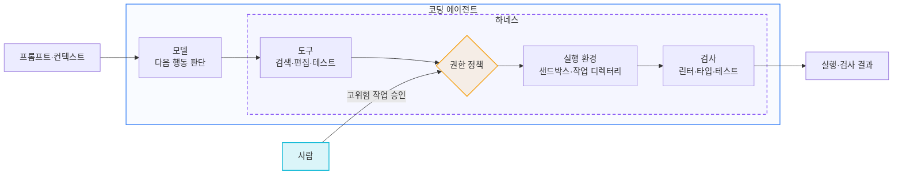
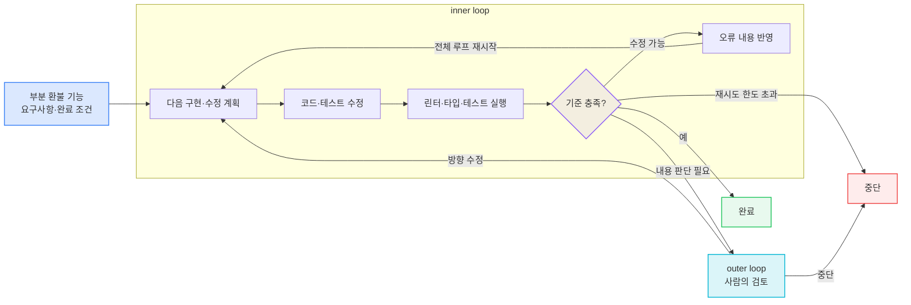
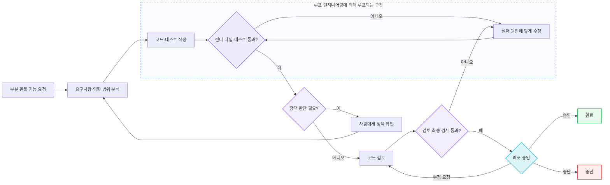

> **한 줄 요약**
> 이 글은 프롬프트부터 그래프까지 이어지는 여러 이름을 지시문, 입력, 실행 환경, 반복, 제어 흐름이라는 서로 다른 설계 대상으로 구분한다. 이름을 따로 외우기보다 지금 겪는 문제가 어디서 발생하는지 보고, 필요한 장치만 선택하면 된다.

---

## 1. 이 글의 목적

에이전트와 함께 일하는 방식을 설명하는 이름은 계속 달라졌다. 이 글에서는 프롬프트 엔지니어링부터 컨텍스트·하네스·루프·그래프 엔지니어링까지, 각 표현이 실제로 무엇을 설계하자는 말인지 살펴본다.

이 글은 각 용어의 사용례와 정리 글을 연표에 함께 놓고 비교한다. 표의 날짜는 인용한 자료의 게시 시점이며, 각 용어의 최초 사용일이나 업계의 채택 순서를 뜻하지는 않는다. 특히 그래프형 오케스트레이션과 `graph engineering`이라는 표현은 2026년 7월 이전에도 사용됐다.[^graph]

이 글은 세 가지를 순서대로 한다.

1. **각 이름이 무엇을 가리키는가** — 인용한 자료의 시점과 각 용어가 다루는 문제, 서로의 관계를 살펴본다 ([2절](#2-용어별-등장-배경과-범위))
2. **무엇을 남기고 무엇을 덜어낼까** — 이름 대신 지금 손댈 층을 가려낸다 ([3절](#3-무엇을-남기고-무엇을-덜어낼까))
3. **새것과 오래 공존한다** — 필요한 것은 가볍게 취하고, 낡은 것은 편하게 버린다 ([4절](#4-새것은-가볍게-받아들이고-낡은-것은-편하게-버린다))

그리고 이 판단을 **Claude Code·Codex 설정 파일 수준으로 내리는 실전**은 별도 글 [엔지니어링.. 뭐?, 이론은 알겠고 실전에서는 어떻게 쓸까?](/posts/22-엔지니어링-뭐-이론은-알겠고-실전에서는-어떻게-쓸까)(실전편)에서 다룬다.

### 먼저, 30초 자가진단 — 나는 얼마나 잘 따라가고 있을까?

아래는 현재도 필요한지 다시 확인해볼 에이전트 활용 습관들이다. 해당하는 항목이 있다면 오른쪽의 관련 영역과 확인 방법을 살펴볼 수 있다.

| 체크 | 습관 | 관련 영역·확인 방법 |
|---|---|---|
| ☐ | 추론 모델에도 처음부터 few-shot 예제를 3~5개 넣는다 | **프롬프트** — 먼저 zero-shot으로 확인 ([3.1절](#31-모델이-이미-잘하는-일은-덜어낸다)) |
| ☐ | "단계적으로 생각해봐"를 여전히 붙인다 | **프롬프트** — 추론 모델에는 불필요하거나 역효과일 수 있다 ([3.1절](#31-모델이-이미-잘하는-일은-덜어낸다)) |
| ☐ | 규칙 파일에서 마지막으로 **줄을 지운** 게 언제인지 모른다 | **컨텍스트** — 기존 규칙의 필요성을 재검토 |
| ☐ | 규칙을 파일로 나누기만 하면 컨텍스트가 절약된다고 믿는다 | **컨텍스트** — 온디맨드 로딩 여부를 확인 |
| ☐ | 작업을 마이크로 태스크로 잘게 쪼개 지시한다 | **프롬프트·루프** — 모델이 직접 계획할 범위를 조정 ([3.1절](#31-모델이-이미-잘하는-일은-덜어낸다)) |
| ☐ | 같은 실수가 반복되는데 규칙만 추가한다 | **하네스** — 실행 가능한 검증 장치를 검토 |
| ☐ | "무엇이 완료인가"를 실행 가능한 검사로 준 적이 없다 | **루프** — 정지 조건을 명시 |
| ☐ | 설정을 바꾼 뒤 성능이 올랐는지 측정한 적이 없다 | **평가** — 변경 전후를 같은 기준으로 비교 |

체크된 항목은 새 기법을 추가할 신호라기보다, 기존 지시·규칙·검증 방식이 지금도 필요한지 확인할 지점이다.

네 번째 항목은 **파일 분할 자체**와 **온디맨드 로딩**을 구분해야 한다. `@import`처럼 시작할 때 전부 불러오는 분할은 정리에는 도움이 되지만 컨텍스트를 줄이지 않는다. 반면 하위 디렉터리 규칙, 경로가 지정된 규칙, Skills처럼 관련 작업에서만 불러오는 방식은 실제로 컨텍스트를 절약한다.[^ccmemory][^skills-format]

---

## 2. 용어별 등장 배경과 범위

### 2.1 연표

| 시기 | 용어 | 계기 / 출처 | 답하려는 질문 | 전제한 모델의 약점 |
|---|---|---|---|---|
| 2020~2022 | **프롬프트 엔지니어링** | GPT-2·GPT-3 생성 실험을 수행하고 효과적인 프롬프트 작성법을 기록해온 Gwern Branwen이 용어 사용(2020)[^prompt] · ChatGPT 공개 이후 사용 증가(2022) | "이 문장을 어떻게 쓸까?" | 모델이 **내 의도를 못 알아듣는다** |
| **2025.06** | **컨텍스트 엔지니어링** | Shopify CEO Tobi Lütke가 용어를 제안(6월 19일), OpenAI 창립 멤버이자 Tesla AI 디렉터를 지낸 Andrej Karpathy가 정의를 덧붙임(6월 25일)[^karpathy] → 2025년 9월 Anthropic이 공식 문서화[^anthropic-ce] | "이번 호출에서 모델이 **무엇을 보는가**?" | 모델이 **내 코드베이스·배경을 모른다** |
| **2026.02** | **하네스 엔지니어링** | HashiCorp 공동창업자 Mitchell Hashimoto가 "My AI Adoption Journey"에서 5단계로 "Engineer the Harness"를 제시(2월 5일)[^harness] · OpenAI 현장 보고(2월 11일) · Thoughtworks에서 AI 기반 소프트웨어 개발 방식을 다뤄온 Birgitta Böckeler가 martinfowler.com에 체계적으로 정리(4월)[^fowler] | "시스템이 무엇을 **예방·측정·교정**해야 하는가?" | 모델이 **같은 실수를 반복한다** |
| **2026.03~06** | **루프 엔지니어링** | V8·Node.js 개발자로 활동해온 Franziska Hinkelmann이 용어를 정의(3월 8일), OpenClaw를 만든 Peter Steinberger가 "에이전트를 프롬프트하는 루프를 설계하라"고 게시(6월 7일)[^loop] | "목표 달성까지 **반복되는 자율 워크플로**는? **무엇이 완료인가?**" | 모델이 **언제 멈춰야 할지 모른다** |
| **2026.07** | **그래프 엔지니어링** | 표현과 그래프형 오케스트레이션은 이전부터 존재 · AI 에이전트 플랫폼 Botpress의 CTO Michael Masson이 엔지니어링 용어의 계보 끝에 graph engineering을 덧붙이고(7월 11일), Steinberger가 "아직 루프를 말하는가, 그래프로 옮겨갔는가?"라고 게시(7월 18일)[^graph] | "단계와 에이전트를 **어떤 상태·전이 구조로 연결**하는가?" | 분기·반복·병렬 실행과 여러 실행 주체를 명시적으로 조율해야 한다 |

표의 시기는 각 용어의 최초 등장일이 아니라, 이 글에서 인용한 자료의 게시 시점이다. 특히 7월의 두 게시물은 새로운 기술을 발표한 글이 아니다. Masson은 프롬프트·컨텍스트·하네스·루프 뒤에 “next is: graph engineering”을 붙였고, 일주일 뒤 Steinberger는 “Are we still talking loops or did we shift to graphs yet?”라고 물었다. 빠르게 바뀌는 용어를 비튼 농담조로 읽히는 게시물이었다.

이후 `graph engineering`을 진지하게 설명하는 글이 잇따랐지만, 이들이 용어나 기술을 만들었다는 뜻은 아니다. `flow (/graph) engineering`이라는 표현은 2024년에도 사용됐고, 그래프형 오케스트레이션은 그보다 전부터 존재했다.[^graph]

각 이름이 다루는 대상은 서로 다르다. [2.3절](#23-각-용어가-실제로-무엇을-가리키는가)에서 보듯 프롬프트는 메시지와 지시문을, 컨텍스트는 호출 하나의 입력 전체를, 하네스는 모델 밖 런타임을, 루프는 시간축을, 그래프는 단계와 실행 주체 사이의 상태 전이를 다룬다. 뒤의 것이 앞의 것을 포함하기도 하지만, 앞에 없던 문제를 새로 여는 쪽이 더 크다.

새 개념은 기존 개념을 대체하기보다 다른 층을 추가한다. 반면 기존 규칙을 언제 제거할지에 대한 기준은 함께 제공되지 않는 경우가 많다. 그 결과 규칙 파일은 추가되는 방향으로만 자라기 쉽다. 지금도 필요한지 다시 볼 항목은 [3.1절](#31-모델이-이미-잘하는-일은-덜어낸다)에서 정리한다.

### 2.2 각 이름이 구분해 다루는 문제

각 용어는 모델이 받는 입력부터 도구를 실행하는 환경, 반복과 정지 조건, 여러 단계의 연결까지 서로 다른 설계 대상을 가리킨다. 아래 표는 이 구분을 단순화해 정리한 것이다.

| 모델 쪽에서 풀린 것 | 그러자 새로 중요해진 문제 | 붙은 이름 |
|---|---|---|
| 지시를 알아듣게 됐다 | 내 코드베이스를 모른다 | 컨텍스트 엔지니어링 |
| 컨텍스트 윈도가 20만 토큰이 됐다 | 넣을 게 많아지자 **무엇을 뺄지**가 문제가 됐다 | 컨텍스트 엔지니어링(후기) |
| 도구 호출이 안정화됐다 | 실행 범위와 권한, 결과 검사를 통제해야 한다 | 하네스 엔지니어링 |
| 장기 작업을 버티게 됐다 | 같은 실수를 반복한다 | 하네스 엔지니어링 |
| 사람 없이도 여러 턴을 돈다 | **언제 멈출지**, 무엇이 <strong>"좋음"</strong>인지 모른다 | 루프 엔지니어링 |
| 행동의 위험을 모델이 판단하게 됐다 (auto mode 분류기) | 승인 지점을 **어디에** 남길지 | 루프의 outer loop 설계 |
| 에이전트 하나가 제법 긴 일을 해낸다 | 분기·병렬 실행·여러 실행 주체를 **어떻게 연결하고 통제할지** | 그래프 엔지니어링 |

**모델이 강해질수록 설계의 초점은 "모델이 못하는 것"에서 "인간이 정해주지 않은 것"으로 이동한다.** 초기 세대가 모델의 결함을 보완하는 기술이었다면, 최근 세대는 **의도를 명시하는 기술**에 가깝다. 이 흐름이 [3절](#3-무엇을-남기고-무엇을-덜어낼까)의 결론으로 이어진다.

### 2.3 각 용어가 실제로 무엇을 가리키는가

**프롬프트 엔지니어링**은 모델에 보내는 요청을 설계하는 일이다. 단순히 “환불 기능을 만들어줘”라고 쓰는 대신 역할, 목표, 제약 조건, 완료 기준과 응답 형식을 하나의 지시문에 구체적으로 적는다.

```text
당신은 결제 시스템 개발 경험이 있는 백엔드 개발자다.

목표:
- 기존 결제 API에 부분 환불 엔드포인트를 추가한다.

제약 조건:
1. 현재 프로젝트의 아키텍처를 따른다.
2. 권한 검사와 중복 요청 방지 로직을 포함한다.
3. 기존 테스트를 삭제하거나 통과하도록 약화하지 않는다.

완료 기준:
- 부분 환불 성공·실패 사례를 단위 테스트로 검증한다.
- 린터, 타입 검사와 테스트를 모두 통과한다.

응답 형식:
- 먼저 변경 계획을 설명한다.
- 작업이 끝나면 변경된 파일과 검사 결과를 요약한다.
```

“당신은 백엔드 개발자다”와 같은 역할 지정, 단계별 지시, 금지 사항, 예시와 출력 형식을 조합하는 것이 대표적인 방법이었다. 다만 “현재 프로젝트의 아키텍처를 따르라”는 문장만으로 모델이 아키텍처를 알 수 있는 것은 아니다. 실제 코드와 규칙을 찾아 제공하는 문제는 뒤에서 설명할 컨텍스트 엔지니어링으로 이어진다.

**컨텍스트 엔지니어링**은 모델이 판단할 때 참고할 정보를 구성하는 일이다. 프롬프트가 “어떻게 써라”를 정한다면, 컨텍스트는 “무엇을 근거로 쓸 것인가”를 정한다. 여기에는 시스템 지시, 대화 이력, 첨부 파일, 검색한 문서, 도구 실행 결과가 모두 포함된다.

부분 환불 기능을 설계할 때는 결제 도메인의 규칙과 API 명세가 필요하다. 코드를 작성할 때는 기존 라우터·서비스·저장소의 구현 방식이 중요하고, 검증할 때는 변경된 코드와 관련 테스트의 실행 결과가 필요하다. 단계마다 필요한 정보가 다르므로 저장소 전체를 처음부터 한꺼번에 넣지 않고, 그 순간 필요한 파일과 결과만 골라 제공한다.

```text
설계할 때: 환불 정책, API 명세, 기존 결제 흐름
구현할 때: 관련 라우터·서비스·저장소, 기존 테스트
검증할 때: 변경된 코드, 테스트·린터·타입 검사의 실패 결과
```

폐기된 API 명세와 현재 코드가 섞이거나 관련 없는 모듈까지 포함되면 어떤 정보를 기준으로 구현해야 하는지 불분명해진다. 그래서 컨텍스트 엔지니어링은 정보를 많이 모으는 일보다, 필요한 정보를 찾고 불필요하거나 충돌하는 정보를 제외하는 일에 가깝다.

Karpathy는 컨텍스트 엔지니어링을 다음 단계에 필요한 정보로 컨텍스트 창을 채우는 일이라고 설명했다.

> "context engineering is the delicate art and science of filling the context window with just the right information for the next step." — Karpathy[^karpathy]

여기서 **다음 단계**가 중요하다. 부분 환불 기능을 설계할 때와 테스트 실패를 고칠 때 필요한 정보는 다르다. 작업 전체에 필요할 법한 자료를 한꺼번에 넣는 대신, 현재 단계의 판단에 필요한 정보로 입력을 다시 구성한다는 뜻이다.

Anthropic은 같은 문제를 정보의 양과 신호의 밀도라는 관점에서 설명한다.

> "find the smallest possible set of high-signal tokens that maximize the likelihood of some desired outcome" — Anthropic[^anthropic-ce]

이는 컨텍스트를 무조건 줄이라는 뜻이 아니다. 원하는 결과를 내는 데 도움이 되는 정보는 남기고, 관련 없거나 중복되거나 서로 충돌하는 정보는 덜어내라는 뜻이다.

**Skills는 이 원리를 구현하는 방법 중 하나다.** Codex는 처음부터 모든 Skill의 내용을 읽지 않고 이름과 설명을 본 뒤, 현재 작업에 맞는 Skill을 선택하면 `SKILL.md`와 필요한 참고 자료를 불러온다. OpenAI는 이를 컨텍스트를 효율적으로 관리하기 위한 **progressive disclosure**라고 설명한다.[^skills-format] Skill에 스크립트와 반복 절차도 함께 묶을 수 있으므로 하네스와 맞닿는 부분은 있지만, 실행 권한·샌드박스·검사 환경까지 대신하는 것은 아니다.

**하네스 엔지니어링**은 에이전트가 일하는 환경을 만든다. 코드 검색·편집·테스트 도구를 제공하고, 로컬 파일 수정은 허용하되 운영 환경 배포는 막을 수 있다. 린터, 타입 검사, 단위 테스트처럼 결과를 검사하는 장치도 여기에 속한다. “안전하게 구현하라”라고 지시하는 데서 그치지 않고 실제 권한과 검사 과정으로 강제하는 것이다. Böckeler의 표현을 빌리면 **"Agent = Model + Harness**"이고, 하네스는 “코딩 에이전트에서 모델을 뺀 전부”다.[^fowler] 컨텍스트가 “무엇을 보여줄까?”를 다룬다면, 하네스는 “무엇을 할 수 있고 어떻게 잘못을 발견할까?”를 다룬다.

```text
바로 실행 가능: 코드 검색, 작업 디렉터리의 파일 수정, 테스트 실행
승인 후 실행: 패키지 설치, 외부 네트워크 접근, 데이터베이스 변경
실행 금지: 운영 환경 배포, 운영 데이터 수정
자동 검사: 린터, 타입 검사, 단위 테스트
```

이 설정들은 프롬프트에 적힌 부탁이 아니라 실제 도구 목록, 샌드박스, 권한 정책과 검사 스크립트로 구현된다.

경계를 그림으로 나타내면 모델은 다음 행동을 판단하고, 하네스는 그 행동이 실제로 실행되는 과정을 통제한다. 프롬프트와 컨텍스트는 모델에 들어가는 입력이고, 사람은 하네스가 자동으로 허용하지 않은 작업만 승인한다.



점선 안이 하네스다. 모델이 “테스트를 실행하겠다”고 판단해도 실제로 사용할 수 있는 도구, 접근 가능한 경로와 실행 전 승인 여부는 하네스가 결정한다. 실행 뒤에는 검사 결과를 다시 모델이나 사람에게 전달한다.

Böckeler의 분류를 기능 개발에 적용하면 다음과 같다. **가이드**는 잘못된 행동을 미리 막고, **센서**는 변경 결과를 확인한다.

|  | **계산적** (결정론적·빠름) | **추론적** (의미적·느림) |
|---|---|---|
| **가이드** (사전 예방) | 운영 배포 권한 차단, 수정 경로 제한 | 코딩 규칙, 아키텍처 원칙 |
| **센서** (사후 교정) | 린터·타입 검사·단위 테스트 | 코드 리뷰, 보안 검토 |

Böckeler는 좋은 하네스의 목적을 인간의 개입을 없애는 것이 아니라, 인간이 꼭 판단해야 할 곳으로 개입을 모으는 것이라고 설명한다.

> "A good harness should not necessarily aim to fully eliminate human input, but to direct it to where our input is most important."[^fowler]

예를 들어 부분 환불 기능에서 린터·타입 검사·반복 테스트는 자동화할 수 있다. 반면 코드만으로 알 수 없는 환불 정책을 정하거나 운영 배포를 승인하는 일은 사람이 맡아야 한다. 하네스는 사람이 모든 단계를 지켜보게 하는 대신, 자동 검사가 해결하지 못한 문제와 위험한 변경에서만 개입하도록 만든다.

**루프 엔지니어링**은 한 번 작성하고 끝내지 않는 구조를 만든다. 에이전트가 코드를 수정한 뒤 린터, 타입 검사와 테스트를 실행하고, 문제가 있으면 결과를 읽어 다시 수정하게 할 수 있다. 여기서 중요한 것은 단순한 반복이 아니라 **무엇을 성공으로 볼지와 언제 포기할지**다. “모든 검사 통과”는 완료 조건이고, “같은 문제가 세 번 반복되면 사람에게 넘긴다”는 중단 조건이다. 단위는 목표에 닿을 때까지 이어지는 **시간축의 반복 전체**다. 실무는 두 겹으로 나눌 수 있다.[^aiewf]

- **inner loop** — 에이전트가 자동으로 도는 부분
- **outer loop** — 인간의 감시, 피드백과 반복 평가가 들어가는 부분

기능 개발 루프를 실행 흐름으로 펼치면 다음과 같다. 매번 결과를 검사하고 **완료·재시도·인간 개입·중단** 중 하나를 선택한다.



**그래프 엔지니어링**은 검사 결과에 따라 다음 행동이 달라질 때 유용해진다. 타입 오류라면 구현 단계로, 요구사항 누락이라면 설계 단계로 돌아가야 한다. 환불 정책이 불분명하다면 사람의 판단을 기다리고, 운영 배포 전에는 승인을 받아야 한다. 모든 문제를 같은 방식으로 다시 처리하지 않고, **현재 상태와 실패 원인에 따라 필요한 단계로 이동하도록 제어 흐름을 명시하는 것**이다.

이때 각 단계는 반드시 에이전트일 필요가 없다. 린터와 테스트는 결정론적 코드이고, 구현과 코드 검토는 모델이 맡을 수 있으며, 정책 결정과 배포 승인은 사람이 맡을 수 있다. 여러 에이전트를 연결하는 것은 그래프의 한 가지 구현일 뿐이다.[^graph]

같은 부분 환불 기능 개발을 그래프로 펼치면 다음과 같다. 기본 검사 실패는 구현으로, 요구사항 누락은 설계로, 리뷰 수정 요청은 코드 검토로 돌아간다.



점선으로 묶은 영역만 보면 구현과 검사를 반복하는 루프다. 그래프는 그 바깥에 정책 확인, 코드 검토, 배포 승인을 연결하고 실패 원인에 따라 **필요한 단계만 다시 실행하도록** 구체화한다. 루프와 그래프 사이에 기술적으로 딱 잘라지는 선이 있는 것은 아니다. 루프 자체가 순환하는 그래프이고, 분기와 상태 전이가 늘어나면서 그래프로 표현할 실익이 커지는 것이다.

여기서 **상태**는 단계 사이를 오가는 작업 기록이다. 변경된 파일, 검사 결과, 확인이 필요한 정책, 재시도 횟수, 승인 여부 등이 들어갈 수 있다. 각 단계가 같은 형식의 상태를 읽고 필요한 부분만 갱신하면 “지금 어디까지 끝났고 다음에 무엇을 해야 하는가”가 코드에 남는다.

이 상태를 체크포인트로 저장하면 실행이 중단되거나 사람의 승인을 기다리는 동안에도 진행 상황을 보존할 수 있다. 이후 처음부터 다시 돌지 않고 저장된 상태와 다음 단계에서 재개할 수 있다. 이는 모든 그래프의 필수 기능은 아니지만, 장기 실행 워크플로에서 그래프형 런타임을 사용하는 중요한 이유 중 하나다.

그래프를 설계할 때는 노드의 개수보다 다음 경계를 먼저 정해야 한다.

- **승인 기준** — 어떤 작업을 자동으로 실행하고, 어떤 작업은 먼저 인간의 승인을 받을 것인가
- **단계 구분** — 작업을 어디까지 나누고, 각 단계에서 무엇을 수행할 것인가
- **다음 단계로 넘어갈 기준** — 성공·실패·재시도·중단을 무엇으로 판정할 것인가
- **다시 실행할 범위** — 실패한 작업만 다시 실행할지, 앞 단계부터 다시 시작할지
- **실행 한도** — 병렬 노드 수, 재시도 횟수, 토큰과 도구 사용량을 어디까지 허용할 것인가
- **인간 개입 지점** — 외부 변경이나 고위험 판단 전에 어디서 승인을 받을 것인가

두 그림에서 프롬프트와 컨텍스트는 각 모델 호출의 입력을 구성하고, 하네스는 도구·권한·샌드박스·검증 장치를 제공한다. 루프는 반복과 종료 조건을, 그래프는 분기와 상태 전이를 구성한다. 이 개념들은 하나의 포함 관계라기보다 실행 과정의 서로 다른 지점에 개입한다.

그래프·상태 머신 기반 오케스트레이션은 LangGraph·AutoGen 같은 도구가 이미 제공해왔다. 따라서 2026년에 새로 생긴 것은 그래프라는 구조가 아니다. 달라진 점은 모델 호출뿐 아니라 도구를 쓰고 여러 단계를 수행하는 **에이전트 실행 전체를 노드로 둘 수 있게 된 것**이다. **루프는 단순한 순환 그래프**이고, 구현에서는 완성된 에이전트 루프 하나를 상위 그래프의 노드로 캡슐화할 수도 있다.[^graph]

다만 루프는 반복할 때마다 모델과 도구를 다시 호출하고, 그래프는 분기·병렬 실행·재시도·검토 노드를 추가할 수 있다. 실행 횟수가 늘면 토큰과 도구 사용량뿐 아니라 상태 저장·추적·장애 복구에 드는 운영 비용도 커질 수 있다. 따라서 더 복잡한 실행 구조는 그 비용을 감수할 만한 제어가 필요할 때 도입하는 편이 낫다.

AI Engineer World's Fair 2026(7월) 정리는 루프를 제어 계층으로 설명했고, 에이전트 하나보다 이를 둘러싼 시스템 설계의 중요성을 강조했다.[^aiewf]

---

## 3. 무엇을 남기고 무엇을 덜어낼까

지금까지의 용어를 모두 별개의 기술처럼 기억할 필요는 없다. 실전에서 어떤 설정을 남기고 덜어낼지 판단하려면, 먼저 무엇이 이미 필요 없어졌고 무엇이 끝까지 남는지부터 가리면 된다.

### 3.1 모델이 이미 잘하는 일은 덜어낸다

few-shot 예제, "단계적으로 생각해봐" 같은 주문, 지나치게 잘게 쪼갠 작업 지시가 언제나 틀린 것은 아니다. 다만 지금도 필요한지는 다시 확인해야 한다. 특히 추론 모델은 먼저 zero-shot으로 평가하고, 복잡한 출력 형식이나 측정된 실패를 교정할 때 few-shot을 추가하는 편이 낫다. 내부적으로 추론하는 모델에 "단계적으로 생각해봐"를 덧붙이는 것은 불필요하거나 성능을 방해할 수도 있다.[^reasoning-prompt] 모델이 이미 안정적으로 수행하는 일을 계속 설명하면 그만큼 중요한 정보가 묻힌다. 컨텍스트 윈도우는 창고가 아니라 작업대에 가까워서, 물건을 올릴수록 일할 자리가 줄어든다.

규칙과 도구도 마찬가지다. 모든 관례를 규칙 파일에 넣거나 모든 MCP를 미리 불러오는 방식은 한때 필요했지만, 지금은 지시 누락과 컨텍스트 낭비를 늘릴 수 있다.[^ifscale][^toolsearch] **예전에 도움이 됐다는 이유만으로 계속 남겨둘 필요는 없다.**

### 3.2 사람이 정해야 하는 것은 남긴다

반대로 모델이 좋아져도 저절로 알 수 없는 것이 있다.

- 이번 작업에서 꼭 알아야 할 배경과 팀의 관례
- 무엇을 "완료"와 "좋음"으로 볼지에 대한 기준
- 무엇을 건드리면 안 되는지에 대한 권한 경계
- 결과를 누가, 어떤 기준으로 검토할지

이것들은 모델의 능력 문제가 아니라 사람이 정해야 하는 문제다. 따라서 도구가 바뀌어도 쉽게 사라지지 않는다.

기술은 계속 발전하고 새로운 개념도 계속 등장한다. 그렇다고 나오는 것마다 모두 익히고 설정에 추가할 필요는 없다. 지금 내 일을 편하게 해주는 것은 가져오고, 더는 도움이 되지 않는 것은 빼면 된다.

중요한 것은 최신 상태를 증명하는 일이 아니다. **현재의 도구와 규칙이 지금의 문제를 실제로 해결하고 있는지**다.

### 3.3 새 개념이 나오면 세 가지만 본다

새로운 프레임워크나 기법을 발견하면 다음 세 가지를 확인한다.

1. **지금 내가 겪는 문제를 해결하는가?**
2. **이미 쓰고 있는 장치와 겹치지 않는가?**
3. **도입한 뒤 일이 더 단순해지는가?**

세 질문에 답이 분명하면 써보면 된다. 지금 필요하지 않다면 이름만 알아두고 지나가도 괜찮다. 나중에 문제가 생겼을 때 다시 꺼내보면 된다.

예를 들어 **그래프 엔지니어링**을 이 세 질문에 넣어보자. ① 지금 내가 겪는 문제를 해결하는가 — 단일 루프에서 분기·승인·병렬 실행·여러 에이전트의 조율이 필요하지 않다면 아직 아니다. ② 이미 쓰는 장치와 겹치는가 — 직선적인 단일 에이전트 실행에서는 루프 하나로 충분하다. ③ 도입하면 단순해지는가 — 오히려 LangGraph 같은 런타임과 노드 간 상태 관리라는 복잡성이 더해질 수 있다. 세 답이 이렇다면 결론은 간단하다. **이름만 알아두고, 제어 흐름을 명시적으로 배선해야 하는 날 다시 꺼내면 된다.** 몰라서 손해 볼 일은 없고, 미리 들여놨다가 짊어질 유지비만 없앤 셈이다.

비용은 새 개념을 모르는 데서가 아니라, 필요하지 않은 개념을 계속 들고 가는 데서 생긴다.

### 3.4 남길 기준보다 버릴 기준을 먼저 만든다

다음 중 하나에 해당하면 제거 후보로 본다.

- 해결하려던 문제가 더는 재현되지 않는다.
- 다른 규칙이나 도구와 같은 역할을 한다.
- 최근 작업에서 사용되지 않았다.
- 제거해도 결과가 달라지지 않는다.
- 유지하려면 계속 설명과 예외가 필요하다.

반대로 안전과 권한 경계, 팀 고유의 완료 기준처럼 사람이 직접 정해야 하는 것은 남긴다. 다만 이것도 긴 설명으로 붙들기보다 권한 설정, 테스트, CI처럼 더 단순하고 확실한 장치로 옮길 수 있는지 살핀다.

좋은 설정은 새로운 개념이 빠짐없이 쌓여 있는 상태가 아니다. **지금 필요한 것만 남아 있고, 필요 없어지면 쉽게 걷어낼 수 있는 상태**다.

---

## 4. 마치며

이 글에서 인용한 그래프 엔지니어링 관련 자료에는 2026년 7월의 게시물과 글이 포함된다. 그러나 그래프형 오케스트레이션은 그전부터 사용됐으므로, 자료의 게시일을 기술의 탄생일로 볼 수는 없다.[^graph]

새 개념이 제시됐다고 곧바로 도입할 필요는 없다. 언제 유용한지, 기존 장치와 무엇이 겹치는지, 운영 비용이 얼마나 드는지는 실제 사용을 통해 확인해야 한다. 그래프 엔지니어링도 단일 루프로 표현하기 어려운 분기·병렬 실행·다중 에이전트 조율이 있을 때 검토하면 된다.

그러니 최신을 실시간으로 좇지 못한다고 불안해하지 않아도 된다. 개념이 어느 정도 검증되고 자리를 잡은 뒤에 편하게 가져오는 편이 오히려 낫다. 늦게 받아들인다고 뒤처지는 것이 아니다. 설익은 것을 먼저 끌어안았다가 도로 버리는 쪽이 더 비싸고, 새 개념을 좇느라 지치는 것이야말로 가장 큰 낭비다. **따라가지 못해 느끼는 피로는, 사실 따라갈 필요가 없는 것을 따라가려 해서 생긴다.**


[^prompt]: "prompt engineering" 용어는 Gwern Branwen이 GPT-3(2020) 맥락에서 사용한 것으로 알려져 있다(개념 자체는 그 이전부터 존재). Branwen은 2020년 6월부터 GPT-3를 직접 실험하며 프롬프트 작성법과 흔한 실패 원인을 기록했다. 원문: https://gwern.net/gpt-3 · 개괄: *The Prompt Report: A Systematic Survey of Prompt Engineering Techniques*, arXiv:2406.06608

[^karpathy]: Shopify CEO Tobi Lütke가 "context engineering"을 "prompt engineering"보다 선호한다고 게시(2025-06-19)했고, Andrej Karpathy가 6일 후 자신의 정의를 덧붙였다(2025-06-25). 원문: https://x.com/karpathy/status/1937902205765607626 · Karpathy의 경력: https://karpathy.ai/

[^fowler]: Birgitta Böckeler, *Harness engineering for coding agent users*, martinfowler.com (2026-04-02). "Agent = Model + Harness", 가이드/센서 × 계산적/추론적, 유지보수성·아키텍처 적합성·행동 하네스 분류. https://martinfowler.com/articles/harness-engineering.html · Thoughtworks 프로필: https://www.thoughtworks.com/profiles/b/birgitta-bockeler

[^harness]: "harness engineering" 용어와 관련해 확인되는 자료 — Mitchell Hashimoto, *My AI Adoption Journey*(2026-02-05), 5단계 "Engineer the Harness": https://mitchellh.spicytakes.org/post/2026-02-05-my-ai-adoption-journey · OpenAI 현장 보고(2026-02-11) · Böckeler의 martinfowler.com 정리(2026-04-02)[^fowler] · 학술 정리: *AI Harness Engineering: A Runtime Substrate for Foundation-Model Software Agents*, arXiv:2605.13357 (2026-05) https://arxiv.org/pdf/2605.13357 *(최초 사용자는 자료마다 다르게 서술되어 특정하지 않는다.)*

[^loop]: Franziska Hinkelmann이 2026-03-08에 "Loop Engineering"을 사용·정의했고, Peter Steinberger(OpenClaw)가 2026-06-07에 에이전트를 프롬프트하는 루프를 설계해야 한다고 게시했다. 날짜와 선행 사용례 정리: https://www.aibuilderclub.com/blog/graph-engineering-peter-steinberger · 개괄: https://www.mindstudio.ai/blog/what-is-loop-engineering-ai-coding-agents

[^graph]: Botpress CTO Michael Masson(@michaelmasson55)은 2026-07-11에 prompt·context·harness·loop engineering을 나열한 뒤 “next is: graph engineering”을 붙였고(https://x.com/michaelmasson55/status/2075913998449701170), Peter Steinberger는 2026-07-18에 “Are we still talking loops or did we shift to graphs yet?”라고 게시했다(https://x.com/steipete/status/2078277297791189132). Masson의 프로필: https://michaelmasson.com/ · 두 게시물은 문맥상 빠른 용어 교체를 비튼 농담조로 읽히지만, 작성자가 의도를 직접 밝힌 것은 아니다. `flow (/graph) engineering`의 2024년 사용례: https://x.com/itamar_mar/status/1763168555539812407 · Steinberger의 게시물 이후 확산 과정: https://www.aibuilderclub.com/blog/graph-engineering-peter-steinberger · LangChain의 기술적 정리(노드는 코드·모델·도구·에이전트가 될 수 있고, 루프는 단순한 순환 그래프): https://www.langchain.com/blog/3-years-of-graph-engineering-with-langgraph · 상태 체크포인트와 재개: https://docs.langchain.com/oss/python/langgraph/persistence · org graph와 work graph 관점: https://www.explainx.ai/blog/graph-engineering-ai-agents-multi-agent-organizations-2026

[^aiewf]: swyx et al., *5 Trends That Defined AI Engineering at World's Fair 2026*, Latent Space (2026-07-14). 루프가 새로운 제어 계층(inner/outer loop), 에이전트 중심에서 시스템 중심으로의 전환, Skills로의 수렴. https://www.latent.space/p/aiewf26trends

[^toolsearch]: Anthropic, Advanced tool use — Tool Search Tool(77K → 8.7K 토큰, 85% 절감) / Programmatic Tool Calling / Tool Use Examples (2025-11). https://platform.claude.com/docs/en/agents-and-tools/tool-use/programmatic-tool-calling · https://www.anthropic.com/engineering/writing-tools-for-agents

[^ifscale]: Daniel Jaroslawicz et al., *How Many Instructions Can LLMs Follow at Once?* (IFScale), arXiv:2507.11538 (2025). 500개 지시에서 정확도 68%, 누락이 지배적 실패, 선행 편향. https://distylai.github.io/IFScale/

[^anthropic-ce]: Anthropic, *Effective context engineering for AI agents* (2025-09). attention budget, altitude, just-in-time. https://www.anthropic.com/engineering/effective-context-engineering-for-ai-agents

[^ccmemory]: Anthropic, *How Claude remembers your project* — `@import`는 시작 시 함께 로드되지만, 하위 디렉터리의 `CLAUDE.md`, 경로 스코프 규칙, Skills는 관련 작업에서 온디맨드로 로드된다. https://code.claude.com/docs/en/memory

[^reasoning-prompt]: OpenAI, *Reasoning best practices* — 추론 모델에서는 zero-shot부터 시도하고, 필요할 때 few-shot을 추가하며, "think step by step" 같은 chain-of-thought 지시는 불필요하거나 방해가 될 수 있다. https://developers.openai.com/api/docs/guides/reasoning-best-practices

[^skills-format]: OpenAI, *Build skills* — Skill은 지침·참고 자료·선택적 스크립트를 묶은 재사용 가능한 워크플로 형식이다. Codex는 처음에는 Skill의 이름과 설명만 보고, 사용할 Skill을 선택한 뒤 전체 `SKILL.md`를 읽는 progressive disclosure 방식을 사용한다. https://learn.chatgpt.com/docs/build-skills
