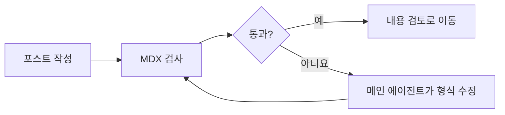
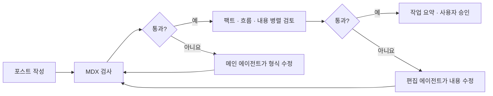

# 엔지니어링.. 뭐?, 이론은 알겠고 실전에서는 어떻게 쓸까?

> **이 글의 자리**
> 이 글은 [프롬프트에서 그래프까지 개발자의 중심 잡기](/posts/21-프롬프트에서-그래프까지-개발자의-중심-잡기)의 실습편이다. 이론편의 두 축인 **정보**(무엇을 보여줄까)와 **판정**(무엇을 완료로 볼까)을 설정과 코드로 옮긴다.

Claude Code와 Codex 예시를 나란히 살펴본다.

---

## 1. 전체 구성: 프롬프트·컨텍스트·하네스·루프·그래프 실습

| 실습 영역 | 도구 중립 원칙 | Claude Code | Codex |
|---|---|---|---|
| **프롬프트** | 목표·제약·완료 기준을 구체적으로 쓴다 | 작업 요청 | 작업 요청 |
| **컨텍스트** — 항상 로드 | 코드를 읽어 알 수 없는 것만, 짧게 | `CLAUDE.md` (200줄 목표) | `AGENTS.md` (`project_doc_fallback_filenames`로 대체 파일명 지정 가능) |
| **컨텍스트** — 범위 지정 | 필요한 경로에서만 로드 | `.claude/rules/` + `paths:` | 하위 디렉터리별 `AGENTS.md` 계층 |
| **컨텍스트** — 온디맨드 | 지침과 자료는 필요할 때만 | Skills, MCP 선택, tool search | Skills, MCP |
| **컨텍스트** — 분리 | 독립 작업의 입력과 결과를 격리한다 | 서브에이전트 | 서브에이전트 |
| **하네스** — 사전 차단 | 실행 가능한 경계로 막는다 | `permissions.deny`, `PreToolUse` | `sandbox_mode`, `writable_roots`, `PreToolUse` |
| **하네스** — 사후 교정 | 실행 결과를 검사한다 | `PostToolUse`, 테스트·린터 | `PostToolUse`, 테스트·린터 |
| **하네스** — 승인 | 사람이 확인할 작업을 정한다 | 퍼미션 모드 | `approval_policy` (`untrusted` / `on-request` / `never` / `granular` 객체) |
| **루프** | 검사 결과를 다음 실행에 연결한다 | `Stop`, `maxTurns` | `Stop`, goals(선택) |
| **그래프** | 조건에 따라 다음 단계와 복귀 지점을 고른다 | LangGraph 같은 외부 런타임 또는 직접 구현 | LangGraph 같은 외부 런타임 또는 직접 구현 |

두 제품은 같은 원칙을 서로 다른 설정으로 구현한다. 정보가 부족하면 규칙 파일이나 Skills를, 판정이 모호하면 테스트·훅·CI를 보강한다. 위험한 행동은 프롬프트가 아니라 권한과 샌드박스로 막는다.[^ccmemory][^codex]

> 아래 예시의 설정 형식은 2026년 8월 기준 공식 문서를 따랐다. 도구는 빠르게 바뀌므로 적용 전 문서 확인을 권한다.[^ccmemory][^cchooks][^ccsubagents][^codex]

---

## 2. 프롬프트 엔지니어링 실습: 목표·제약·완료 기준 전달하기

프롬프트에는 모델이 이번 작업에서 판단할 기준을 적는다. 역할을 길게 꾸미는 것보다 목표, 변경 범위, 금지 사항과 완료 기준을 구체적으로 쓰는 편이 중요하다.

```text
기존 결제 API에 부분 환불 엔드포인트를 추가해줘.

제약:
- 현재 프로젝트의 아키텍처와 에러 응답 형식을 따른다.
- 권한 검사와 중복 요청 방지 로직을 포함한다.
- 기존 테스트를 삭제하거나 통과하도록 약화하지 않는다.

완료 기준:
- 부분 환불 성공·실패 사례를 단위 테스트로 검증한다.
- 린터, 타입 검사와 테스트를 모두 통과한다.

작업이 끝나면 변경된 파일과 검사 결과를 요약한다.
```

이 프롬프트는 **무엇을 할지**와 **무엇을 완료로 볼지**를 전달한다. 하지만 “현재 프로젝트의 아키텍처”가 무엇인지는 프롬프트만으로 알 수 없다. 관련 코드와 규칙을 필요한 시점에 제공하는 일은 컨텍스트 엔지니어링의 영역이다.

---

## 3. 컨텍스트 엔지니어링 실습: 입력을 구성하고 분리하기

### 3.1 `CLAUDE.md`와 `AGENTS.md`: 항상 로드되는 정보 줄이기

`CLAUDE.md`와 `AGENTS.md`는 모델에 주입되는 지침이지 강제 설정이 아니다.

> "CLAUDE.md content is delivered as a user message after the system prompt, not as part of the system prompt itself. Claude reads it and tries to follow it, but **there's no guarantee of strict compliance**."[^ccmemory]

강제 차단은 훅이나 권한 설정으로 내려보내야 한다. Claude Code는 `CLAUDE.md`를 200줄 아래로 유지하도록 권하며, `@path`로 파일을 나눠도 모두 로드되므로 토큰은 줄지 않는다.[^ccmemory]

컨텍스트를 줄이는 방법은 세 가지다.

**(a) 경로 스코프 규칙** — `.claude/rules/`에 `paths:` frontmatter를 쓰면 **매칭되는 파일을 읽을 때만** 로드된다. 이게 진짜 just-in-time이다.

```markdown
<!-- .claude/rules/api.md -->
---
paths: # 이 규칙을 불러올 파일 범위
  - "src/api/**/*.{ts,tsx}" # API의 TypeScript 파일에만 적용
---

# API 규칙

- 모든 엔드포인트는 입력 검증을 포함한다
- 에러 응답은 `src/api/errors.ts`의 표준 포맷을 쓴다
```

`paths`가 없는 규칙은 매 세션 로드된다. 전역 규칙만 `CLAUDE.md`에 남기고 나머지는 경로로 제한한다.

Codex의 계층 규칙은 로딩 시점이 다르다. 작업을 시작할 때 프로젝트 루트부터 현재 작업 디렉터리까지 내려오며 `AGENTS.md`를 합친다. 저장소 공통 규칙과 모듈별 규칙은 다음처럼 나눌 수 있다.

```text
repo/
├── AGENTS.md                    # 저장소 공통 규칙
└── services/
    ├── payments/
    │   ├── AGENTS.md            # 결제 모듈 규칙
    │   └── src/
    └── search/
        └── AGENTS.md            # 검색 모듈 규칙
```

루트에는 공통 규칙을 두고:

```markdown
<!-- AGENTS.md -->
# 저장소 공통 규칙

- 공개 API를 바꾸면 마이그레이션 문서를 갱신한다
- 커밋 전 `pnpm test`를 실행한다
```

결제 모듈에는 더 좁은 규칙을 둘 수 있다.

```markdown
<!-- services/payments/AGENTS.md -->
# 결제 모듈 규칙

- 통합 테스트는 `make test-payments`로 실행한다
- 결제 요청과 응답에 시크릿을 기록하지 않는다
```

결제 모듈에서 시작하면 두 파일이 루트부터 합쳐지고 하위 규칙이 우선한다. Claude Code의 `paths:`와 달리 시작 시 현재 작업 디렉터리까지만 읽는다.[^codex]

**(b) Skills** — 규칙(`rules/`)은 매 세션 또는 매칭 시 로드되지만, Skills는 **호출하거나 관련 있다고 판단될 때 본문이 로드된다.** Claude Code와 Codex 모두 이 방식을 지원한다. 다단계 절차나 특정 작업에서만 필요한 참고 자료는 Skills로 분리한다.[^codex]

**(c) HTML 주석** — Claude Code에서는 블록 레벨 HTML 주석이 컨텍스트에 주입되기 전에 제거된다. 유지보수 노트를 **토큰 0**으로 남길 수 있다(코덱스에는 해당 기능이 없다).

```markdown
<!-- 2026-05: 빌드 스크립트 변경 시 이 섹션 갱신 (담당: 인프라팀) -->
## 빌드
- `pnpm build` (npm 아님)
```

규칙은 구체적으로 쓴다.[^ccmemory]

| ❌ | ✅ |
|---|---|
| "코드를 깔끔하게 포맷하세요" | "2-space 인덴트를 쓴다" |
| "변경 사항을 테스트하세요" | "커밋 전에 `npm test`를 돌린다" |
| "파일을 정리하세요" | "API 핸들러는 `src/api/handlers/`에 둔다" |

중복·충돌·낡은 규칙을 지우고, 규칙 파일에는 **코드를 읽어서 알 수 없는 것**만 남긴다.

### 3.2 Skills와 MCP: 지침·자료와 도구를 필요할 때 불러오기

도구가 많아지면 선택 성능과 입력 토큰에 영향을 줄 수 있다. 다만 몇 개부터 문제라는 공통 기준은 없다.[^longfunceval][^mcpgauge]

다음은 온디맨드 로딩이 적용된 Claude Code 세션에서 `/context`를 확인한 한 사례다.

```text
Context Usage                                  247.1k/1m tokens (25%)
  System prompt          5.4k  (0.5%)
  System tools            10k  (1.0%)
  Memory files            351  (0.0%)
  Skills                 2.5k  (0.3%)
  Messages             228.9k  (22.9%)

MCP tools · /mcp (loaded on-demand)
└ 24 tools · 0 tokens          ← 24개인데 0 토큰

Skills · /skills
└ 23 skills · 2.5k tokens      ← 23개가 설명만 2.5k
```

이 세션에서는 MCP 도구 정의가 온디맨드로 처리됐고, Skills는 이름과 설명만 먼저 들어갔다. Codex Skills도 선택된 뒤 전체 `SKILL.md`를 읽는다. 숫자는 환경마다 다르므로 절감률로 일반화할 수 없다.[^codex]

여기서 Skills의 중심은 작업에 맞는 지침과 자료를 불러오는 **컨텍스트 관리**다. 선택적 스크립트도 묶을 수 있지만 권한과 샌드박스를 대신하지는 않는다. MCP도 도구 정의를 온디맨드로 불러오는 것은 컨텍스트 문제이고, 불러온 도구의 실행을 허용하거나 차단하는 것은 하네스 문제다.

필요한 도구만 켜고, 가능하면 검색이나 온디맨드 로딩으로 고른다.[^ragmcp][^toolsearch]

### 3.3 서브에이전트 실습: 하나의 포스트를 세 관점으로 검토하기

포스트를 작성한 에이전트가 같은 맥락에서 곧바로 자신의 글을 검토하면 작성 의도를 그대로 정당화하기 쉽다. 이번 실습에서는 검토 관점을 팩트, 문맥 흐름, 내용 완성도로 나누고 세 서브에이전트에 병렬로 맡겼다.[^codex]

| 에이전트 | 확인할 것 | 권한 |
|---|---|---|
| `blog_fact_reviewer` | 외부 주장과 출처 | read-only |
| `blog_flow_reviewer` | 문단 순서, 중복, 어려운 표현 | read-only |
| `blog_content_reviewer` | 핵심 질문에 충분히 답했는지 | read-only |

각 리뷰어는 중요한 지적을 최대 5개만 정해진 JSON으로 반환한다. 원문을 다시 옮겨 적지 않고 결과만 압축하므로 메인 작업의 컨텍스트도 덜 차지한다.

```toml
# .codex/agents/blog-fact-reviewer.toml
name = "blog_fact_reviewer"
description = "블로그 포스트의 외부 검증 가능한 주장과 출처만 확인한다."
model = "gpt-5.6-terra"
model_reasoning_effort = "high"
sandbox_mode = "read-only"

developer_instructions = """
날짜, 제품 동작, 기술 사양과 인용을 공식 문서나 1차 출처로 확인한다.
파일은 수정하지 않고 passed와 findings를 담은 JSON만 반환한다.
"""
```

검토 에이전트에는 쓰기 권한을 주지 않았다. 세 결과를 실제 포스트에 반영하는 일은 `workspace-write` 권한을 가진 `blog_editor` 하나가 맡는다. 검토와 수정을 분리하면 여러 에이전트가 같은 파일을 동시에 고치는 충돌도 피할 수 있다.

재검토할 때는 같은 역할의 에이전트를 새로 만들지 않는다. 현재 작업의 에이전트 목록을 확인하고, 있으면 후속 작업을 보내 재사용하며 없을 때만 생성한다. 작업 목록이 불필요하게 늘어나는 것은 막지만 재검토를 위한 모델 호출 비용까지 없어지는 것은 아니다.

서브에이전트는 관점이 독립적이고 반환 결과가 원문보다 짧을 때 유용하다. 단순 조회처럼 메인 에이전트가 직접 해도 같은 결과가 나온다면 위임하지 않는 편이 낫다.[^cognition][^multiagent] Claude Code에서는 같은 역할을 `.claude/agents/*.md`로 정의할 수 있다.[^ccsubagents]

---

## 4. 하네스 엔지니어링 실습: 권한·샌드박스·훅으로 실행 통제하기

### 4.1 권한·샌드박스·`PreToolUse`: 실행 전에 막기

Claude Code에서는 `permissions.deny`로 단순한 금지 규칙을, `PreToolUse`로 조건이 있는 차단을 구현한다.[^ccmemory]

아래 JSON 설정은 설명용 주석을 넣기 위해 JSONC로 표기했다. 사용하는 도구가 주석을 지원하지 않으면 주석을 제거하고 저장한다.

`.claude/settings.json`:

```jsonc
{
  "permissions": { // 도구 실행 권한 설정
    "deny": [ // 조건에 맞으면 항상 차단
      "Read(./.env)", // .env 읽기 차단
      "Read(./secrets/**)", // secrets 하위 파일 읽기 차단
      "Bash(git push:*)" // git push 명령 차단
    ]
  }
}
```

규칙 파일의 지시와 달리 이 설정은 클라이언트가 집행한다.

조건이 복잡하면 `PreToolUse` 훅을 쓴다. **exit code 2가 차단**이다.

`.claude/settings.json`:

```jsonc
{
  "hooks": { // 훅 등록
    "PreToolUse": [ // 도구 실행 직전에 호출
      {
        "matcher": "Bash", // Bash 도구에만 적용
        "hooks": [ // 조건이 맞을 때 실행할 훅
          {
            "type": "command", // 외부 명령 실행
            "command": "${CLAUDE_PROJECT_DIR}/.agent-hooks/guard-bash.sh", // 실행할 스크립트
            "timeout": 10 // 최대 실행 시간(초)
          }
        ]
      }
    ]
  }
}
```

```bash
#!/bin/bash
# .agent-hooks/guard-bash.sh — Claude Code와 Codex가 함께 사용
input=$(cat)
cmd=$(jq -r '.tool_input.command' <<<"$input")

if grep -qE 'rm -rf|:> *\.env' <<<"$cmd"; then
  echo "파괴적 명령 차단: $cmd" >&2
  exit 2          # 2 = 강제 차단, stderr가 이유로 전달된다
fi
exit 0
```

Codex에서는 같은 스크립트를 `.codex/hooks.json`에 등록한다. `.codex/config.toml`은 필요하지 않다.

`.codex/hooks.json`:

```jsonc
{
  "hooks": { // 훅 등록
    "PreToolUse": [ // 도구 실행 직전에 호출
      {
        "matcher": "^Bash$", // Bash 도구와 정확히 일치
        "hooks": [ // 조건이 맞을 때 실행할 훅
          {
            "type": "command", // 외부 명령 실행
            "command": "/bin/bash \"$(git rev-parse --show-toplevel)/.agent-hooks/guard-bash.sh\"", // 저장소 루트의 스크립트 실행
            "timeout": 10, // 최대 실행 시간(초)
            "statusMessage": "Checking shell command" // 실행 중 표시할 메시지
          }
        ]
      }
    ]
  }
}
```

Codex도 JSON 입력과 exit code 2를 사용한다. 프로젝트 훅은 추가하거나 바꾼 뒤 CLI에서는 `/hooks`, Desktop에서는 **설정 → Hooks**에서 신뢰하고 활성화해야 한다. `matcher`에는 `Bash`, `Edit|Write`, MCP 도구 패턴 등을 지정할 수 있다.[^codex]

샌드박스는 훅의 선행 조건이 아니라 별도의 실행 경계다. 훅은 모든 실행 경로를 포괄하지 않으므로 샌드박스를 대체하지 않는다.[^codex]

### 4.2 퍼미션 모드와 승인 정책: 사람이 확인할 시점 정하기

Claude Code에서는 퍼미션 모드로 사람이 확인할 시점을 정한다. 아래 표는 `Shift+Tab`으로 순환하는 목록이 아니라 **지원하는 전체 모드**다.[^ccpermmodes]

| 모드 (설정값) | 표시 이름 | 묻지 않고 실행되는 것 |
|---|---|---|
| `default` | Manual | 읽기 |
| `acceptEdits` | Edit automatically | 읽기 + 작업 디렉터리 내 파일 편집과 일반적인 파일 명령 |
| `plan` | Plan | 코드 탐색과 계획 작성 (소스 편집 차단) |
| `auto` | Auto | 별도 분류기가 허용한 행동 |
| `dontAsk` | Don't ask | 미리 승인된 것만 (그 외 자동 거부) |
| `bypassPermissions` | Bypass permissions | 퍼미션 계층을 우회 |

CLI의 `Shift+Tab` 기본 사이클은 `default` → `acceptEdits` → `plan`이다.

- `auto`는 지원 조건을 만족할 때 사이클에 추가된다.
- `bypassPermissions`는 실행 옵션이나 설정으로 먼저 허용해야 사이클에 나타난다.
- `dontAsk`는 `Shift+Tab` 사이클에 나타나지 않는다. `claude --permission-mode dontAsk`로 지정한다.
- Desktop과 VS Code에서는 `Shift+Tab`이 아니라 모드 선택기를 사용한다.

`auto`는 별도 분류기 모델이 행동을 심사한다. 대화에서 말한 경계는 컴팩션 뒤 사라질 수 있으므로 확실한 금지는 `deny`로 둔다. 넓은 allow 규칙은 auto 진입 시 빠지고, 서브에이전트의 `permissionMode`도 무시된다. 분류기 호출은 토큰과 왕복 시간을 추가한다.[^ccpermmodes]

- 되돌리기 어려운 작업은 `plan`에서 검토한 뒤 실행한다.
- 결제나 배포 경로는 `PreToolUse`에서 별도로 막는다.

Codex는 승인 여부를 `approval_policy`, 실행 범위를 `sandbox_mode`로 나눈다. 서브에이전트도 현재 작업의 퍼미션 모드와 샌드박스 정책을 적용받는다.[^codex]

퍼미션 모드와 승인 정책은 사람과 에이전트의 관계를 설명하는 별도 엔지니어링 영역이 아니라, 어떤 행동을 자동으로 허용하고 어디서 승인을 받을지 정하는 **하네스의 실행 경계**다.

---

## 5. 루프 엔지니어링 실습: 포스트가 형식을 통과할 때까지 고치기

3.3절의 포스트 검토를 시작하기 전에 MDX 형식부터 검사했다. 이 검사는 모델의 판단이 필요 없다. frontmatter의 필수 값, 본문 H1, 썸네일 파일, 코드 블록, 각주와 MDX 렌더링 여부를 스크립트로 확인한다.

이 실습 전체에서는 다음 세 훅을 사용했다.[^codex]

| 훅 | 실행 시점 | 이 실습에서 하는 일 |
|---|---|---|
| `UserPromptSubmit` | 사용자 프롬프트가 모델에 전달되기 직전 | 작업 전 포스트 상태 기록 |
| `Stop` | 메인 에이전트가 현재 턴을 끝내려 할 때 | 변경된 포스트의 MDX 검사와 그래프 실행 |
| `SubagentStop` | 서브에이전트가 작업을 끝내려 할 때 | 리뷰어와 편집자의 마지막 응답 저장 |

`Stop`에서 `decision: "block"`을 반환하면 현재 결과를 거부하는 것이 아니라, `reason`이 연속 프롬프트로 전달되어 Codex가 작업을 계속한다. 이 동작을 이용하면 검사를 통과하기 전에는 완료하지 않는 루프를 만들 수 있다.[^codex]

```jsonc
{
  "hooks": {
    "UserPromptSubmit": [
      {
        "hooks": [
          { "type": "command", "command": "node \"$(git rev-parse --show-toplevel)/.codex/hooks/blog_snapshot.mjs\"" }
        ]
      }
    ],
    "Stop": [
      {
        "hooks": [
          { "type": "command", "command": "node \"$(git rev-parse --show-toplevel)/.codex/hooks/blog_review.mjs\"" }
        ]
      }
    ]
  }
}
```

형식 오류가 있으면 `Stop` 훅이 실패 이유를 전달해 메인 에이전트의 작업을 이어간다. 에이전트가 오류를 고치고 다시 끝내려 하면 같은 검사가 반복된다.



이것이 이 실습의 첫 번째 루프다. 매번 파일을 쓸 때마다 검사하는 `PostToolUse`도 있지만, 여기서는 포스트 작성 도중이 아니라 완료 시점에 한 번 검사하면 충분하므로 `Stop`을 사용했다. 여러 턴의 완료 조건을 따로 관리해야 한다면 Codex의 goals 기능을 활성화한 뒤 `/goal`을 보조 수단으로 사용할 수 있다.[^codex]

---

## 6. 그래프 엔지니어링 실습: 형식 검사와 내용 검토를 연결하기

루프가 하나라면 5절의 흐름으로 충분하다. 이번 실습에서는 MDX를 통과한 뒤 세 서브에이전트의 내용 검토로 넘어가고, 실패 종류에 따라 다른 주체가 수정하도록 연결했다.



성공 경로는 왼쪽에서 오른쪽으로 읽힌다. MDX가 실패하면 메인 에이전트가 형식만 고치고, 내용 검토가 실패하면 편집 에이전트가 세 의견을 모아 수정한다. 어느 쪽이든 수정 후에는 MDX 검사부터 다시 시작한다.

| 구성 요소 | 맡은 일 |
|---|---|
| MDX 검사 스크립트 | 코드로 판단할 수 있는 형식 검사 |
| 검토 에이전트 3개 | 팩트, 문맥 흐름, 내용 완성도를 병렬 검토 |
| 편집 에이전트 1개 | 검토 결과를 모아 포스트 수정 |
| LangGraph | 검사 결과에 따라 다음 단계와 복귀 지점 결정 |
| Codex 훅 | 작업 종료를 멈추고 그래프가 고른 작업 실행 |

그림은 구현 파일이나 훅 재호출 과정을 모두 그린 것이 아니라 **이 자동화가 사용자에게 보이는 흐름**만 나타낸다. 실제 구현에서는 `Stop`이 LangGraph를 실행하고, 서브에이전트 결과는 `SubagentStop`으로 모은다. LangGraph가 직접 글을 쓰거나 에이전트를 실행하는 것이 아니라 다음에 무엇을 할지 결정하고, Codex가 그 작업을 수행한다.[^graphframeworks]

자동 반복에는 한도를 뒀다. 한도를 넘거나 결과를 모으지 못하면 더 반복하지 않고 이유를 보여준 뒤 사용자에게 판단을 넘긴다. 모든 검사를 통과해도 자동으로 완료하지 않고 작업 요약과 함께 승인을 기다린다.

실제로 시험했을 때는 세 리뷰어가 병렬로 검토하고, 편집 에이전트가 지적을 한 번 반영한 뒤, 같은 리뷰어들을 재사용해 다시 확인했다. 이 실습 안에 **서브에이전트의 역할 분리**, **검사 실패를 되돌리는 루프**, **실패 종류에 따른 분기**, **사용자 승인**이 모두 들어 있다.

다만 검토를 반복할 때마다 모델 호출 비용은 늘어난다. 그래서 먼저 값싼 MDX 검사를 통과시킨 뒤 모델을 호출하고, 단순한 문맥 검토에는 더 작은 모델을 사용했다. 실패 경로가 하나뿐이라면 LangGraph를 붙이지 않고 `Stop` 루프로 끝내는 편이 낫다.

---

## 7. 가장 작은 설정부터 적용하는 순서

지금까지의 설정을 한꺼번에 적용하려 하면 오히려 복잡도만 늘어난다. 본문의 작은 단위에서 큰 단위로 올라가며 다음 순서로 적용하는 편이 낫다.

1. **작업 기준을 쓴다.** 프롬프트에 목표, 변경 범위, 금지 사항과 완료 기준을 구분해 적는다.
2. **측정한다.** 세션 시작 시점의 컨텍스트 점유율을 기록한다. 이 숫자가 앞으로의 기준선이다. *(Claude Code: `/context`)*
3. **규칙 파일을 깎는다.** 200줄 아래를 목표로, 코드를 읽어서 알 수 있는 건 다 지운다. `/doctor`의 크기 경고는 참고하되, 내용은 직접 검토한다.
4. **적용 범위를 좁힌다.** 특정 디렉터리에서만 필요한 규칙은 그 경로에 묶어 둔다. *(Claude Code: `.claude/rules/` + `paths:` / Codex: 하위 모듈별 `AGENTS.md` 계층)*
5. **도구를 줄인다.** 현재 작업에 필요하지 않은 MCP 서버를 끈다.
6. **실행 경계를 만든다.** "~해야 한다"로 시작하는 문장을 훑어서, 결정론적으로 차단 가능한 것을 권한·샌드박스·`PreToolUse`로 옮긴다.
7. **완료 기준을 루프로 만든다.** 타입체크·테스트를 걸고, 실패 원인을 짧고 충분하게 전달한다. *(`Stop` 훅, 또는 CI 필수 통과 게이트)*
8. **필요할 때만 위임한다.** 반환 결과가 원문보다 충분히 짧거나 별도 관점이 필요할 때 서브에이전트를 쓴다.
9. **분기와 복귀가 생길 때만 그래프로 간다.** 단일 루프로 표현할 수 있다면 그래프를 추가하지 않는다.
10. **다시 측정한다.** 설정을 추가하기 전보다 결과가 나아졌는지 확인하고, 차이가 없다면 제거한다.

Anthropic 자신의 원칙도 같은 방향이다 — *"가장 단순한 해법을 찾고, 필요할 때만 복잡도를 올려라"*, *"더 단순한 해법이 부족할 때만"*.[^simple]


[^codex]: OpenAI Codex 공식 문서 — `AGENTS.md` 계층과 `project_doc_fallback_filenames`: https://learn.chatgpt.com/docs/agent-configuration/agents-md · Skills의 점진적 공개: https://learn.chatgpt.com/docs/build-skills · 서브에이전트: https://learn.chatgpt.com/docs/agent-configuration/subagents · `PreToolUse`·`PostToolUse`·`Stop` 훅: https://learn.chatgpt.com/docs/hooks · `approval_policy`, `sandbox_mode`, `writable_roots`, `features.goals`: https://learn.chatgpt.com/docs/config-file/config-reference · 검증 가능한 정지 조건을 향해 여러 턴 동안 작업하는 `/goal`: https://learn.chatgpt.com/use-cases/follow-goals

[^ccmemory]: *How Claude remembers your project* — CLAUDE.md 계층·200줄 기준·`@import`가 컨텍스트를 줄이지 않는다는 서술·`.claude/rules/`의 `paths:` 스코프·HTML 주석 제거·"user message after the system prompt"·PreToolUse 훅 권고. https://code.claude.com/docs/en/memory

[^ccdoctor]: *Debug your Claude Code configuration* — `/doctor`의 설정·설치 진단 기능. https://code.claude.com/docs/en/debug-your-config · 큰 메모리 파일과 서브에이전트 정의 경고: https://code.claude.com/docs/en/errors

[^cchooks]: *Hooks* — 이벤트 목록, `settings.json` 구조, `matcher` 문법, exit code 2의 차단 의미, `Stop` 훅의 `decision: "block"`. https://code.claude.com/docs/en/hooks

[^ccsubagents]: *Create custom subagents* — 파일 위치와 frontmatter(`name`, `description`, `tools`, `disallowedTools`, `model`, `permissionMode`, `maxTurns`, `memory`, `isolation`), 컨텍스트 격리와 비용 절감. https://code.claude.com/docs/en/sub-agents

[^ccpermmodes]: *Choose a permission mode* — `Shift+Tab` 사이클과 6개 모드(`default`/`acceptEdits`/`plan`/`auto`/`dontAsk`/`bypassPermissions`), auto mode 분류기의 기본 차단·허용 목록, 대화 경계가 컴팩션에 취약하다는 서술과 "For a hard guarantee, add a deny rule instead", auto 진입 시 광범위 allow 규칙 드롭, 서브에이전트 `permissionMode` 무시, 분류기 비용과 3회/20회 폴백. https://code.claude.com/docs/en/permission-modes · 권한 규칙 문법과 `disableAutoMode`: https://code.claude.com/docs/en/permissions · 분류기 설계 배경: https://www.anthropic.com/engineering/claude-code-auto-mode

[^harnessbench]: *Harness-Bench: Measuring Harness Effects across Models in Realistic Agent Workflows*, arXiv:2605.27922 (2026-05). 106개 과제, 5,194 트레이스, execution-alignment failure. https://arxiv.org/abs/2605.27922

[^contextrot]: Chroma Research, *Context Rot: How Increasing Input Tokens Impacts LLM Performance* (2025). 18개 모델. 디스트랙터 1개로도 성능 하락, 200K 윈도가 50K에서 이미 열화. https://www.trychroma.com/research/context-rot

[^longfunceval]: Kiran Kate et al., *LongFuncEval*, arXiv:2505.10570 (2025). 도구 수를 늘린 실험에서 모델별 성능이 7~85% 하락했다. https://arxiv.org/abs/2505.10570

[^mcpgauge]: Wei Song et al., *Help or Hurdle? Rethinking Model Context Protocol-Augmented Large Language Models*, arXiv:2508.12566 (2025). MCP 도입 시 평균 −9.5%, 입력 토큰 3.25~236.5배. https://arxiv.org/abs/2508.12566

[^ragmcp]: *RAG-MCP: Mitigating Prompt Bloat in LLM Tool Selection via Retrieval-Augmented Generation*, arXiv:2505.03275 (2025). 도구 선택 정확도 13.62% → 43.13%. https://arxiv.org/pdf/2505.03275

[^toolsearch]: Anthropic, Advanced tool use — Tool Search Tool(77K → 8.7K 토큰, 85% 절감) / Programmatic Tool Calling / Tool Use Examples (2025-11). https://platform.claude.com/docs/en/agents-and-tools/tool-use/programmatic-tool-calling · https://www.anthropic.com/engineering/writing-tools-for-agents

[^multiagent]: Anthropic, *How we built our multi-agent research system* — 멀티에이전트는 채팅 대비 약 15배 토큰. https://www.anthropic.com/engineering/built-multi-agent-research-system

[^cognition]: Cognition, *Don't Build Multi-Agents* — 멀티에이전트 실패의 주요 원인으로 에이전트 사이의 불충분한 컨텍스트 공유를 지적한다. https://cognition.com/blog/dont-build-multi-agents · 이후 조정된 입장: *Multi-Agents: What's Actually Working* https://cognition.com/blog/multi-agents-working

[^graphframeworks]: LangGraph JavaScript 공식 문서 — `StateGraph`의 상태·노드·일반 엣지·조건부 엣지와 `compile()`: https://docs.langchain.com/oss/javascript/langgraph/graph-api · 설치와 기본 실행: https://docs.langchain.com/oss/javascript/langgraph/overview *(API는 버전에 따라 바뀔 수 있으므로 적용 전 공식 문서를 확인한다.)*

[^simple]: Anthropic, *Building effective agents* (2024-12) — "finding the simplest solution possible, and only increasing complexity when needed". https://www.anthropic.com/engineering/building-effective-agents
